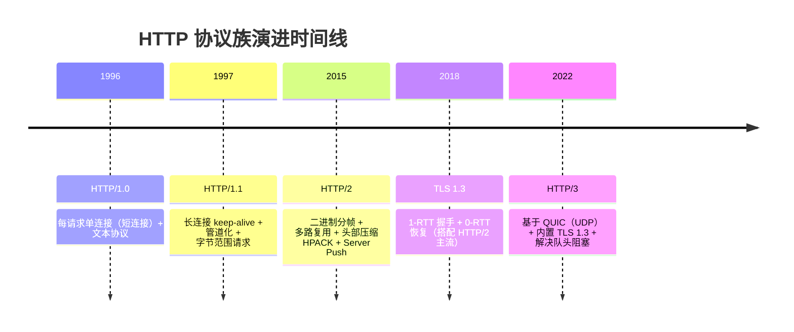
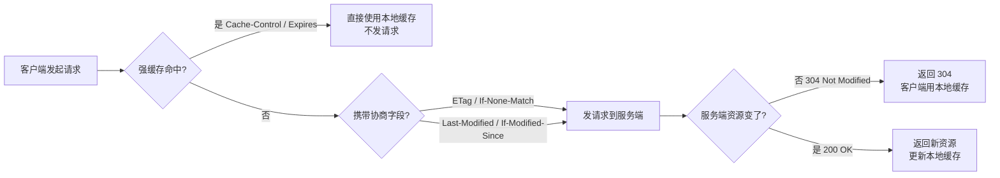
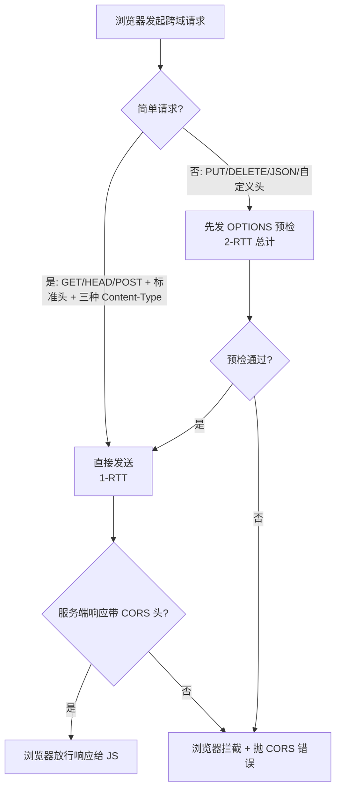
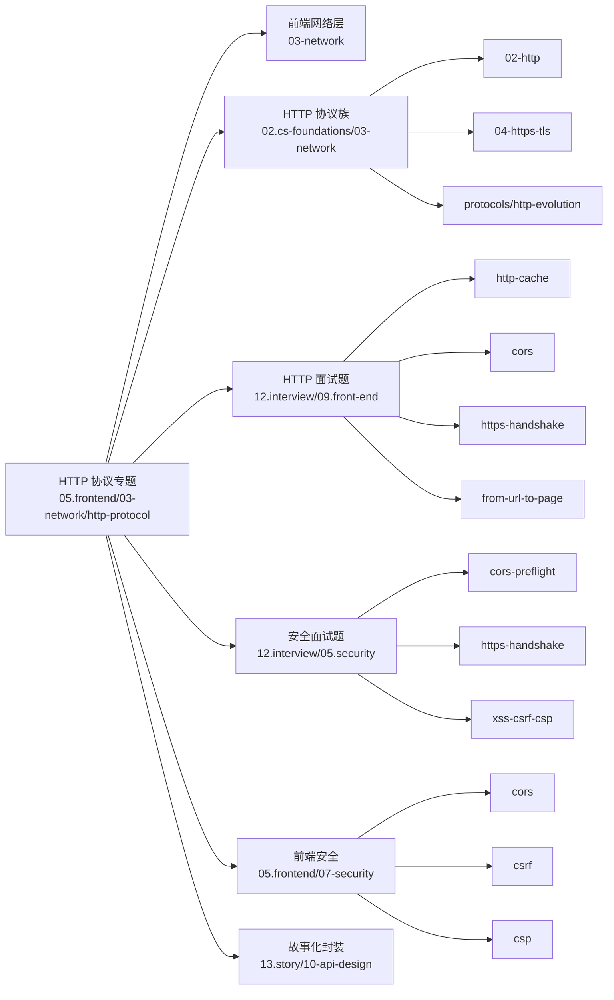

<!--
module:
  parent: 03-network
  slug: 03-network/http-protocol
  type: index-only
  category: HTTP 协议
  summary: HTTP 协议专题索引 —— REST 请求语义（GET vs POST） 与 HTTP 协议族核心机制
  depth: ⭐
-->

# HTTP 协议专题

> **定位**：HTTP 协议层的实战问题 + REST 语义辨析。覆盖 GET vs POST、安全性、幂等性、缓存语义等高频考点。

---

## 子文章清单（共 1 篇，find 校对 2026-08-20）

| 主题 | 难度 | 一句话核心 | 入口 |
|------|------|-----------|------|
| **GET vs POST** | ⭐⭐ | REST 语义辨析（安全性 / 幂等性 / 缓存性 / 长度限制 / TCP 包数） | [get-vs-post.md](get-vs-post.md) |

---

## HTTP 协议族全景图

HTTP 协议从 1996 年的 HTTP/1.0 演进到 2022 年的 HTTP/3，每一次大版本都解决了上一代**最痛的工程问题**——从短连接到长连接、从文本分帧到二进制分帧、从 TCP 到 QUIC。

**关键特性对照**：

| 版本 | 连接模型 | 传输层 | 队头阻塞 | 握手 RTT | 典型场景 |
|------|---------|--------|---------|---------|---------|
| HTTP/1.0 | 短连接（每请求建/拆） | TCP | 严重（连接级） | 1-RTT TCP + TLS | 历史背景 |
| HTTP/1.1 | 长连接（默认 keep-alive） | TCP | 严重（请求级） | 1-RTT TCP + TLS | 主流 Web 应用 |
| HTTP/2 | 多路复用（单连接并发流） | TCP | TCP 层仍有（丢包阻塞整连接） | 1-RTT TCP + TLS | 现代 CDN / 高并发站点 |
| HTTP/3 | QUIC 多路复用（独立流） | UDP（QUIC） | 无（流级独立） | 0-RTT / 1-RTT QUIC | 移动弱网 / 实时通信 |

**深度原理详见**：[`02.cs-foundations/03-network/protocols/http-evolution`](../../../02.cs-foundations/03-network/protocols/http-evolution/README.md)

---

## HTTP 状态码分类速查

HTTP 状态码是**服务器对请求结果的标准化表达**——前端工程师必须能从状态码快速定位问题类型（参数错？权限不足？服务挂了？）。

| 类别 | 范围 | 含义 | 常用状态码 | 典型场景 |
|------|------|------|-----------|---------|
| **1xx 信息** | 100–199 | 中间状态，请求未完成 | `100 Continue`、`101 Switching Protocols`、`102 Processing` | 大文件上传先验权、WebSocket 升级 |
| **2xx 成功** | 200–299 | 请求被服务端正确处理 | `200 OK`、`201 Created`、`204 No Content`、`206 Partial Content` | 列表查询成功、POST 创建成功、DELETE 无返回体、断点续传 |
| **3xx 重定向** | 300–399 | 资源位置变更，需进一步动作 | `301 Moved Permanently`、`302 Found`、`303 See Other`、`304 Not Modified`、`307 Temporary Redirect` | 永久迁移、临时跳转、POST 防重、协商缓存命中 |
| **4xx 客户端错** | 400–499 | 请求本身有问题 | `400 Bad Request`、`401 Unauthorized`、`403 Forbidden`、`404 Not Found`、`405 Method Not Allowed`、`409 Conflict`、`429 Too Many Requests` | 参数校验失败、未登录、无权限、资源不存在、方法不允许、版本冲突、限流 |
| **5xx 服务端错** | 500–599 | 服务端处理失败 | `500 Internal Server Error`、`502 Bad Gateway`、`503 Service Unavailable`、`504 Gateway Timeout` | 未捕获异常、上游网关挂、服务降级中、上游超时 |

**反直觉陷阱**：

- `301` vs `302`：浏览器对 `301` 会**记忆**（下次直接跳，POST 降级为 GET）；`302` 不记忆（每次都问服务端）。SEO 场景必须区分
- `304` 不是错误：是协商缓存命中，响应**无 Body**，体积最小
- `403` vs `401`：401 = 未认证（需要登录）；403 = 已认证但无权限（角色不足）
- `502` vs `504`：502 = 网关**收到上游错误响应**；504 = 网关**等不到上游响应**（超时）。502 通常上游服务挂了，504 通常上游太慢

---

## HTTP 方法语义表

HTTP 方法语义是 REST 架构的**基石**——选错方法会让 API 难以理解、难以缓存、难以重试。

| 方法 | 语义 | 安全性 | 幂等性 | 可缓存 | Body | 典型用途 |
|------|------|:-----:|:-----:|:-----:|:----:|---------|
| **GET** | 读取资源 | ✅ | ✅ | ✅ | 规范不推荐 | 列表 / 详情 / 搜索 |
| **POST** | 创建资源 / 触发动作 | ❌ | ❌ | ❌（除非显式声明） | ✅ | 注册 / 表单 / 上传 |
| **PUT** | 整体替换资源 | ❌ | ✅ | ❌ | ✅ | 全量更新用户信息 |
| **PATCH** | 局部更新资源 | ❌ | ❌（实现相关） | ❌ | ✅ | 修改昵称 / 状态切换 |
| **DELETE** | 删除资源 | ❌ | ✅ | ❌ | 可选 | 删除订单 / 注销账号 |
| **HEAD** | 同 GET，仅返回响应头 | ✅ | ✅ | ✅ | ❌ | 检查资源是否存在 / 元数据 |
| **OPTIONS** | 询问支持的方法 / CORS 预检 | ✅ | ✅ | ❌ | ❌ | CORS 预检 / API 自描述 |

**关键概念辨析**：

- **安全性（Safe）**：调用不会修改服务器状态。GET / HEAD / OPTIONS 是"安全方法"，浏览器可自动重试
- **幂等性（Idempotent）**：多次调用结果一致。PUT / DELETE 幂等但非安全（会改状态），GET / HEAD 既安全又幂等
- **可缓存性（Cacheable）**：响应是否可被浏览器 / CDN 缓存。GET / HEAD / 部分状态码默认可缓存
- **网络重试前提**：浏览器 / SDK 自动重试只对**幂等方法**安全（PUT 多次结果一致，POST 多次可能重复下单）

**深度原理详见**：[get-vs-post.md](get-vs-post.md) 第八节「其他 HTTP 方法扩展」

---

## HTTP 缓存机制速查

HTTP 缓存是前端性能优化的**第一道防线**——一次成功的缓存命中能让接口响应从 200ms 降到 1ms 以内。

### 三件套优先级

### 关键头部对照

| 头部 | 类型 | 作用 | 优先级 | 示例 |
|------|------|------|:-----:|------|
| `Cache-Control: max-age=N` | 强缓存 | 资源在 N 秒内有效，过期前不发请求 | ⭐⭐⭐⭐⭐ | `max-age=31536000, immutable` |
| `Expires: <GMT 时间>` | 强缓存 | HTTP/1.0 时代的过期时间（已被 Cache-Control 取代） | ⭐⭐ | `Expires: Wed, 21 Oct 2026 07:28:00 GMT` |
| `ETag: "abc123"` | 协商缓存 | 资源唯一标识（哈希 / 版本号） | ⭐⭐⭐⭐ | `ETag: "5d8c72a5edda3"` |
| `If-None-Match: "abc123"` | 协商缓存（请求） | 携带上次 ETag，询问资源是否变化 | ⭐⭐⭐⭐ | `If-None-Match: "5d8c72a5edda3"` |
| `Last-Modified: <GMT>` | 协商缓存 | 资源最后修改时间（秒级精度） | ⭐⭐ | `Last-Modified: Wed, 21 Oct 2026 07:28:00 GMT` |
| `If-Modified-Since: <GMT>` | 协商缓存（请求） | 携带上次修改时间，询问是否更新 | ⭐⭐ | `If-Modified-Since: Wed, 21 Oct 2026 07:28:00 GMT` |

### 实战配置模板

| 资源类型 | 推荐配置 | 原因 |
|---------|---------|------|
| **HTML** | `Cache-Control: no-cache` | 每次协商（304 省 body），保证内容及时性 |
| **带 hash 的 JS/CSS** | `Cache-Control: max-age=31536000, immutable` | 文件名带 hash，内容变更即换 URL，可永久缓存 |
| **图片 / 字体** | `Cache-Control: max-age=2592000`（30 天） | 体积大、变更少，适合长缓存 |
| **API GET 响应** | `Cache-Control: private, max-age=60` | 短缓存 + `private` 防 CDN 缓存个人数据 |

**深度原理详见**：[`12.interview/09.front-end/http-cache`](../../../12.interview/09.front-end/http-cache/README.md)

---

## REST 最佳实践 vs 反模式

REST 不是"用 HTTP 发请求"那么简单——**URL 设计、状态码语义、错误处理**都是工程素养的体现。

### URL 设计

| 反模式 ❌ | 最佳实践 ✅ |
|---------|------------|
| `POST /getUser?id=123` | `GET /users/123` |
| `POST /deleteUser?id=123` | `DELETE /users/123` |
| `GET /search?type=1&sort=asc&page=1&size=20&...` | `POST /search` + Body（复杂查询） |
| URL 用动词 `/getUsers` | URL 用名词复数 `/users` |

### 状态码使用

| 反模式 ❌ | 最佳实践 ✅ |
|---------|------------|
| 所有成功都返回 `200`，body 里塞 `{code: 0, msg: "ok"}` | 真实状态码 + 语义化错误码（HTTP 层管传输、业务层管业务） |
| 删除成功返回 `200` + 空 body | 删除成功返回 `204 No Content`（语义精确） |
| 创建成功返回 `200` | 创建成功返回 `201 Created` + `Location` 头指向新资源 |
| 找不到资源返回 `200` + `{found: false}` | 找不到返回 `404 Not Found` |

### 错误处理

| 反模式 ❌ | 最佳实践 ✅ |
|---------|------------|
| 500 异常时直接返回 HTML 错误页 | 返回结构化 JSON `{error: {code, message, details}}` |
| 401 / 403 不区分，统一返回"登录失败" | 401 = 未登录、403 = 无权限（前端可据此跳转登录页） |
| 限流时返回 `200` | 限流时返回 `429 Too Many Requests` + `Retry-After` 头 |

### 幂等性

| 反模式 ❌ | 最佳实践 ✅ |
|---------|------------|
| POST 创建订单不做防重（用户多点几下就重复扣款） | POST 带幂等性 Token（`Idempotency-Key` 头），服务端去重 |
| PUT 全量更新时部分字段丢失 | PATCH 局部更新（JSON Patch / JSON Merge Patch） |

### 版本演进

| 反模式 ❌ | 最佳实践 ✅ |
|---------|------------|
| 上线新版本直接改 URL（破坏老客户端） | URL 版本化 `/api/v1/users`、`/api/v2/users` |
| 用自定义 header 当版本号（难发现） | 主流：URL 路径版本；少数：请求头 `Accept: application/vnd.myapi.v2+json` |

---

## 面试高频考点

HTTP 协议是前端面试**必考模块**——以下 7 个问题命中率最高，每个都指向知识库对应深读文章。

| 高频问题 | 难度 | 推荐深读 |
|---------|:----:|---------|
| **GET vs POST 的本质区别**（不是"GET 取数据 POST 提交数据"那么浅） | ⭐⭐ | [get-vs-post.md](get-vs-post.md) 9 大维度 + 反直觉陷阱 |
| **HTTP 缓存机制**（强缓存 vs 协商缓存、304 流程） | ⭐⭐⭐⭐ | [`12.interview/09.front-end/http-cache`](../../../12.interview/09.front-end/http-cache/README.md) |
| **HTTP vs HTTPS 的区别**（握手过程、对称 / 非对称加密） | ⭐⭐⭐ | [`12.interview/09.front-end/https-handshake`](../../../12.interview/09.front-end/https-handshake/README.md) |
| **CORS 跨域详解**（简单请求 / 预检 / 凭证请求） | ⭐⭐⭐⭐ | [`12.interview/09.front-end/cors`](../../../12.interview/09.front-end/cors/README.md) |
| **HTTP/1.1 vs HTTP/2 vs HTTP/3 的演进**（队头阻塞 / 多路复用 / QUIC） | ⭐⭐⭐⭐ | [`02.cs-foundations/03-network/protocols/http-evolution`](../../../02.cs-foundations/03-network/protocols/http-evolution/README.md) |
| **从 URL 输入到页面展示的全链路**（DNS / TCP / TLS / HTTP / 渲染） | ⭐⭐⭐⭐⭐ | [`12.interview/09.front-end/from-url-to-page`](../../../12.interview/09.front-end/from-url-to-page/README.md) |
| **RESTful API 设计规范**（URL 命名 / 状态码 / 幂等性） | ⭐⭐⭐ | [本 README §REST 最佳实践](#rest-最佳实践-vs-反模式) + [`02.cs-foundations/03-network/02-http`](../../../02.cs-foundations/03-network/02-http/README.md) |

**30 秒话术模板（GET vs POST）**：

> GET 和 POST 本质都是 HTTP 请求方法，差异体现在 9 个维度：语义上 GET 只读、POST 可能改状态；参数位置 GET 走 URL、POST 走 Body；GET 幂等可缓存、POST 非幂等不缓存；GET 可收藏书签、POST 不行。**真正的安全性靠 HTTPS，不是 POST**——POST 只是不把数据放 URL 而已，照样会写入浏览器历史、Referer 头、CDN 边缘节点。

---

## 工程实战陷阱

HTTP 协议在工程落地时有很多**容易被忽视的细节**——以下 3 个场景踩坑率最高。

### CORS 预检的双 RTT 成本

CORS 把 HTTP 请求分成两类：

**性能优化建议**：

- 接口设计尽量**走简单请求**（GET / POST + `application/x-www-form-urlencoded` / `multipart/form-data` / `text/plain`）
- 非简单请求的预检响应加 `Access-Control-Max-Age: 86400`，缓存预检结果**一天**
- 服务端 `Access-Control-Allow-Origin` 在凭证请求下**不能是 `\*`**，必须精确回显请求的 `Origin`

**深度原理详见**：[`12.interview/05.security/cors-preflight`](../../../12.interview/05.security/cors-preflight/README.md)

### Cookie 安全的三个关键属性

| 属性 | 作用 | 推荐配置 | 反例 |
|------|------|---------|------|
| **`HttpOnly`** | JS 无法读取 Cookie（防 XSS 窃取） | ✅ 始终开启 | ❌ 关掉后 `document.cookie` 可读，XSS 直接偷会话 |
| **`Secure`** | 仅 HTTPS 下发送 Cookie | ✅ 生产环境开启 | ❌ HTTP 下明文传输，被中间人截获 |
| **`SameSite`** | 跨站请求是否携带 Cookie | `Strict`（最严）/ `Lax`（默认，推荐） | ❌ `None`（必须配合 Secure，跨站携带易受 CSRF） |

**Token 存储方案对比**（不限于 Cookie）：

| 存储位置 | XSS 风险 | CSRF 风险 | 容量 | API 调用 | 适用场景 |
|---------|:-------:|:--------:|:----:|:-------:|---------|
| **Cookie + HttpOnly** | 低 | 中（需 SameSite / CSRF Token） | 4KB | 自动携带 | 传统 SSR 登录态 |
| **LocalStorage** | 高（JS 可读） | 低 | 5–10MB | 手动加 Authorization 头 | SPA + Token（需配合 CSP 防 XSS） |
| **SessionStorage** | 高（JS 可读） | 低 | 5–10MB | 手动加 | 临时状态（关页即清） |
| **内存变量** | 低 | 低 | 无限制 | 手动加 | 高敏感 Token（刷新即失） |

**深度原理详见**：[`12.interview/09.front-end/token-storage-security`](../../../12.interview/09.front-end/token-storage-security/README.md)

### Content-Length 与 chunked 编码

请求 / 响应 Body 的传输有两种模式：

| 模式 | 标识 | 适用场景 | 优点 | 缺点 |
|------|------|---------|------|------|
| **定长 Body** | `Content-Length: 1024` | 资源大小已知（文件 / JSON） | 简单可靠 | 必须先算总大小（动态内容困难） |
| **分块传输** | `Transfer-Encoding: chunked` | 流式输出 / 动态内容 | 无需预知总大小 / 支持实时推送 | 需要额外解析分块边界 |

**实战陷阱**：

- Node.js 用 `http` 模块时，`res.end()` 前必须设 `Content-Length` 或启用 `chunked`——否则客户端一直等
- 反向代理（Nginx）默认会缓冲响应再转发，**关闭缓冲才能实现流式 SSE**
- HTTP/2 / HTTP/3 已经**不再需要 chunked**——它们有自己的帧分片机制

---

## 反向链 + 跨模块联动

本专题是 HTTP 协议在**前端视角**的入口，与知识库其他模块形成以下知识网络：

### 按模块展开

- **上游协议族**：[`02.cs-foundations/03-network`](../../../02.cs-foundations/03-network/README.md) — TCP/IP / DNS / TLS / HTTP 协议族底层支撑（[`02-http`](../../../02.cs-foundations/03-network/02-http/README.md) / [`04-https-tls`](../../../02.cs-foundations/03-network/04-https-tls/README.md) / [`protocols/http-evolution`](../../../02.cs-foundations/03-network/protocols/http-evolution/README.md)）
- **前端网络层**：[`../README.md`](../README.md) — 浏览器 Network / 缓存 / CORS 整体视角
- **前端安全模块**：[`../../07-security`](../../07-security/README.md) — CORS / CSRF / CSP / XSS 深度防护（[`cors`](../../07-security/cors/README.md) / [`csrf`](../../07-security/csrf/README.md) / [`xss`](../../07-security/xss/README.md)）
- **高频面试题（前端方向）**：[`12.interview/09.front-end`](../../../12.interview/09.front-end/README.md) — [`http-cache`](../../../12.interview/09.front-end/http-cache/README.md) / [`cors`](../../../12.interview/09.front-end/cors/README.md) / [`https-handshake`](../../../12.interview/09.front-end/https-handshake/README.md) / [`from-url-to-page`](../../../12.interview/09.front-end/from-url-to-page/README.md) / [`token-storage-security`](../../../12.interview/09.front-end/token-storage-security/README.md)
- **高频面试题（安全方向）**：[`12.interview/05.security`](../../../12.interview/05.security/README.md) — [`cors-preflight`](../../../12.interview/05.security/cors-preflight/README.md) / [`https-handshake`](../../../12.interview/05.security/https-handshake/README.md) / [`xss-csrf-csp`](../../../12.interview/05.security/xss-csrf-csp/README.md)
- **故事化封装**：[`13.story/10-api-design`](../../../13.story/10-api-design.md) — 用阿明餐厅的类比讲透 API 设计取舍

---

## 关联主题

- **HTTP 协议族**：[`02.cs-foundations/03-network`](../../../02.cs-foundations/03-network/README.md) — TCP/IP / DNS / TLS 底层支撑
- **前端网络层**：[`../README.md`](../README.md) — 浏览器 Network / 缓存 / CORS
- **安全相关**：[`05.frontend/07-security`](../../07-security/README.md) — CORS / CSRF / CSP
- **面试速查**：[`12.interview/09.front-end`](../../../12.interview/09.front-end/README.md) — HTTP / HTTPS / 缓存 / 跨域 面试题集

---

← [返回前端网络层](../README.md)
