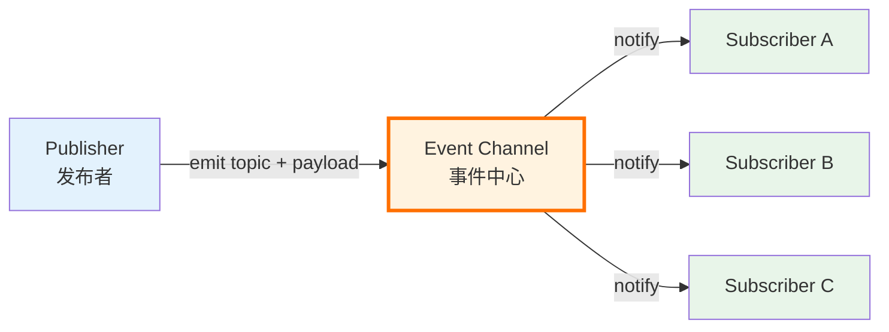

<!--
module:
  parent: front-end
  slug: front-end/pub-sub-pattern
  type: article
  category: 主模块子文章
  summary: Pub-Sub（发布-订阅）用"事件中心"解耦发布者和订阅者，3 角色 Publisher / Event Channel / Subscriber；与 Observer 5 维对比 + 5 反直觉点 + 30 行手写 EventEmitter。
    depth: ⭐⭐⭐⭐⭐
-->

# 发布-订阅者模式（Pub-Sub Pattern）

> 一句话定位：**Pub-Sub = 用一个"事件中心"解耦发布者和订阅者 —— 双方都不知道对方存在，只跟事件中心通信**。3 角色：Publisher / Event Channel / Subscriber。

Pub-Sub 是前端"跨组件通信 + 全局通知 + 实时数据流"的底层范式之一。Event Bus、Redux subscribe、Zustand subscribe、Pinia `$subscribe`、postMessage + EventTarget、WebSocket + EventEmitter —— **都是 Pub-Sub 的变体**。

但**90% 的前端面试者会把"Vue 响应式"也叫 Pub-Sub**，这是错的。Vue 响应式是 **Observer Pattern（Watcher/Dep 持有 Subject 引用）**，不是真正的 Pub-Sub。两者差在一个"共享事件中心 vs 直接持有引用"。详见 §4 五维对比。

---

## 一、核心原理：3 角色 + 1 事件中心

### 1.1 3 角色拓扑图



**关键约束**：

- Publisher **不知道** Subscriber 的存在（不持有引用）
- Subscriber **不知道** Publisher 的存在（只关心"我订阅的事件名"）
- **Event Channel 是唯一中介** —— 这就是 Pub-Sub 与 Observer 的核心区别

### 1.2 事件中心的实现：`Map<eventName, Set<callback>>`

最简洁的实现就是一张表：

```js
// 全局事件中心（Event Channel）
const eventBus = {
  // Map<eventName, Set<callback>>
  _events: new Map(),

  // 订阅
  on(event, callback) {
    if (!this._events.has(event)) {
      this._events.set(event, new Set())
    }
    this._events.get(event).add(callback)
  },

  // 发布（同步触发）
  emit(event, ...args) {
    const subs = this._events.get(event)
    if (!subs) return
    subs.forEach(cb => cb(...args))
  },

  // 取消订阅
  off(event, callback) {
    const subs = this._events.get(event)
    if (!subs) return
    subs.delete(callback)
  },
}
```

**为什么用 `Map` 而不是普通对象**：
- `Map` 的 key 不限于字符串（可以用 Symbol、对象、函数作 key）
- `Map` 的 size 是 O(1)，遍历性能更优
- `Map` 不污染原型链（不像 `obj['__proto__']` 这种坑）

**为什么 callback 用 `Set` 而不是 `Array`**：
- `Set` 的 `add/delete/has` 都是 O(1)
- 自动去重（同一个 callback 多次 on 不会重复触发）
- 迭代顺序 = 插入顺序（FIFO）

### 1.3 同步 vs 异步触发

| 模式 | 触发方式 | 优点 | 缺点 |
|------|---------|------|------|
| **同步 emit** | `subs.forEach(cb => cb(...args))` | 实现简单、顺序可控 | 长任务阻塞当前调用栈 |
| **异步 emit（microtask）** | `queueMicrotask(() => cb(...args))` 或 `Promise.resolve().then(...)` | 不阻塞发布者、避免栈溢出 | 顺序在下一轮 tick 才执行 |
| **异步 emit（macrotask）** | `setTimeout(cb, 0)` | 真正"延后"到下一轮 | 顺序最不可控，性能差 |

> **反直觉（反直觉 5）**：异步 Pub-Sub **应该用 microtask**，不是 `setTimeout(fn, 0)`。microtask 在当前宏任务结束前清空，对订阅者来说仍然"紧跟"发布，但不会阻塞发布者。

---

## 二、手写实现：30 行 EventEmitter（Node.js 风格 API）

### 2.1 同步版本（最常用）

```js
class EventEmitter {
  constructor() {
    this._events = new Map() // Map<eventName, Set<callback>>
  }

  on(event, listener) {
    if (typeof listener !== 'function') {
      throw new TypeError('listener must be a function')
    }
    if (!this._events.has(event)) {
      this._events.set(event, new Set())
    }
    this._events.get(event).add(listener)
    return this // 支持链式调用
  }

  emit(event, ...args) {
    const subs = this._events.get(event)
    if (!subs || subs.size === 0) return false
    // 用 [...subs] 复制一份，防止回调中 off 导致遍历异常
    for (const listener of [...subs]) {
      listener.apply(this, args)
    }
    return true
  }

  off(event, listener) {
    const subs = this._events.get(event)
    if (!subs) return this
    if (listener) {
      subs.delete(listener)
    } else {
      subs.clear()
    }
    return this
  }

  once(event, listener) {
    const wrap = (...args) => {
      this.off(event, wrap) // 先解绑，再回调（防止回调中 emit 导致死循环）
      listener.apply(this, args)
    }
    wrap._origin = listener // 保留原引用，off 时可识别
    this.on(event, wrap)
    return this
  }

  removeAllListeners(event) {
    if (event === undefined) {
      this._events.clear()
    } else {
      this._events.get(event)?.clear()
    }
    return this
  }

  listenerCount(event) {
    return this._events.get(event)?.size ?? 0
  }
}
```

### 2.2 Promise 异步版本（microtask）

```js
class AsyncEventEmitter extends EventEmitter {
  emit(event, ...args) {
    const subs = this._events.get(event)
    if (!subs || subs.size === 0) return false
    // 用 microtask 异步触发
    queueMicrotask(() => {
      for (const listener of [...subs]) {
        try {
          listener.apply(this, args)
        } catch (err) {
          // 异步模式下，单个回调抛错不影响其他订阅者
          console.error(`[AsyncEventEmitter] listener for "${event}" threw:`, err)
        }
      }
    })
    return true
  }
}
```

**适用场景**：

- 同步版本：业务事件、`mitt` / `EventEmitter3` 默认实现
- 异步版本：高频 emit（如鼠标移动、滚动），避免回调阻塞发布者

### 2.3 once 的两种实现

```js
// 方案 A：先 off 再回调（推荐，避免递归 emit 死循环）
once(event, listener) {
  const wrap = (...args) => {
    this.off(event, wrap)
    listener.apply(this, args)
  }
  this.on(event, wrap)
  return this
}

// 方案 B：标志位（性能稍差，但更易调试）
once(event, listener) {
  let fired = false
  const wrap = (...args) => {
    if (fired) return
    fired = true
    this.off(event, wrap)
    listener.apply(this, args)
  }
  this.on(event, wrap)
  return this
}
```

### 2.4 错误隔离

```js
emit(event, ...args) {
  const subs = this._events.get(event)
  if (!subs) return false
  for (const listener of [...subs]) {
    try {
      listener.apply(this, args)
    } catch (err) {
      // 单个订阅者抛错不影响其他订阅者（Pub-Sub 的健壮性约定）
      this.emit('error', err)
    }
  }
  return true
}
```

**约定**：Node.js EventEmitter 把错误作为 `error` 事件单独 emit；浏览器 `window.dispatchEvent` 则会向上抛出。**前端更推荐 try/catch 隔离 + emit('error')**。

---

## 三、Pub-Sub vs Observer：5 维对比

### 3.1 对比表

| 维度 | **Pub-Sub（发布-订阅）** | **Observer（观察者）** |
|------|------------------------|---------------------|
| **耦合度** | 完全解耦（双方不知彼此） | 半耦合（Observer 持有 Subject 引用） |
| **通信方式** | 异步多对多（通过事件中心） | 同步一对多（Subject 直接调 Observer） |
| **依赖关系** | 共享 Event Channel（全局 / 注入） | Subject 直接 addObserver(observer) |
| **常见实现** | mitt / EventEmitter3 / Node EventEmitter / postMessage | Vue Watcher/Dep / MobX reaction / Java Observable |
| **前端应用** | EventBus / 跨组件通信 / 实时数据流 | Vue 响应式 / MobX / RxJS Subject 内部 |

### 3.2 代码对比

**Pub-Sub 实现**（发布者不知道订阅者）：

```js
// 全局事件中心（双方共享）
const bus = new EventEmitter()

// 发布者：A 组件
function ComponentA() {
  button.onClick = () => bus.emit('user-login', { id: 123 })
  // A 完全不知道谁订阅了 user-login
}

// 订阅者：B 组件（在另一个文件、另一个层级）
function ComponentB() {
  bus.on('user-login', user => renderProfile(user))
  // B 完全不知道谁发布了 user-login
}
```

**Observer 实现**（Subject 持有 Observer 引用）：

```js
// Subject（被观察的目标）
class Subject {
  constructor() {
    this.observers = [] // 显式持有 Observer 引用
  }
  addObserver(observer) {
    this.observers.push(observer)
  }
  notify(data) {
    this.observers.forEach(obs => obs.update(data))
    // Subject 直接调 Observer.update —— 这就是"持有引用"
  }
}

// Observer
class Observer {
  update(data) { console.log('got:', data) }
}

// 使用
const sub = new Subject()
sub.addObserver(new Observer()) // Subject 知道 Observer 的存在
sub.notify('hello')
```

### 3.3 Vue 响应式为什么是 Observer 而不是 Pub-Sub

```js
// Vue 2 核心（简化）
class Dep {
  constructor() {
    this.subs = [] // Dep 显式持有 Watcher 引用 —— Observer 特征
  }
  depend() {
    if (Dep.target) this.subs.push(Dep.target)
  }
  notify() {
    this.subs.forEach(watcher => watcher.update())
  }
}

class Watcher {
  constructor(vm, renderFn) {
    Dep.target = this // Watcher 注册到全局 Dep.target
    renderFn()        // 渲染时触发 getter → 收集依赖
    Dep.target = null
  }
}
```

**关键证据**：

- `Dep.subs` 数组**直接持有 Watcher 引用**（不是通过事件中心查）
- `Dep.target` 用全局变量传递当前 Watcher（Pub-Sub 不需要这种"上下文指针"）
- 数据 setter → `dep.notify()` → **同步调用** `watcher.update()`（Pub-Sub 通常异步）

> **反直觉 1**：Vue 响应式是 Observer Pattern（Watcher/Dep 持有 Subject 引用），不是真正的 Pub-Sub。Vue 没有"事件中心"概念，Dep 是**每个属性独立一个**，且直接持有 Watcher 引用。详见 [Vue 响应式原理面试题](../../../../12.interview/09.front-end/vue-reactivity/README.md)。

### 3.4 怎么选

| 场景 | 推荐 | 理由 |
|------|------|------|
| **跨组件 / 跨模块通知** | Pub-Sub（EventBus / mitt） | 完全解耦，适合"通知型"语义 |
| **跨标签页 / iframe** | Pub-Sub（postMessage + EventTarget） | BroadcastChannel 天然 Pub-Sub |
| **状态变化驱动 UI 更新** | Observer（Vue 响应式 / MobX） | 需要精准依赖收集 + 同步触发 |
| **流式数据处理** | Pub-Sub 高级形态（RxJS Subject） | 多播 + 转换算子 + 背压 |

---

## 四、前端应用 4 大场景

### 4.1 组件通信（跨层级 EventBus）

```js
// Vue 2 全局 EventBus
// main.js
Vue.prototype.$bus = new Vue()

// 组件 A 发送
this.$bus.$emit('cart-add', product)

// 组件 B 接收（任意层级）
this.$bus.$on('cart-add', product => {
  this.cart.push(product)
})

// Vue 3 推荐 mitt（200 bytes，无 this 依赖）
import mitt from 'mitt'
const bus = mitt()
bus.emit('cart-add', product)
bus.on('cart-add', product => { /* ... */ })
```

> **反直觉 2**：EventBus 全局单例 = **内存泄漏隐患**。组件销毁时必须 `off` 解绑，否则订阅函数持有组件引用，组件无法 GC。Vue 2 必须在 `beforeDestroy` 钩子里 `$bus.$off(event, callback)`；Vue 3 用 mitt 时在 `onUnmounted` 里 `bus.off(event, callback)`。

### 4.2 全局状态管理（subscribe 模式）

**Redux**：

```js
const store = createStore(reducer)
const unsubscribe = store.subscribe(() => {
  const state = store.getState()
  console.log('state changed:', state)
})

// 触发 action
store.dispatch({ type: 'INCREMENT' })
// 上面 subscribe 回调自动触发

unsubscribe() // 取消订阅
```

**Zustand**（细粒度订阅）：

```js
const useStore = create((set) => ({
  count: 0,
  inc: () => set(s => ({ count: s.count + 1 })),
}))

// 组件外订阅（不通过 hook）
const unsub = useStore.subscribe(
  state => state.count, // selector
  (count, prevCount) => console.log(count, prevCount), // listener
  { equalityFn: Object.is } // 优化
)
```

**Pinia**：

```js
const store = useCartStore()
store.$subscribe((mutation, state) => {
  // mutation.type: 'direct' | 'patch object' | 'patch function'
  // state: 整个 store 状态
  console.log('cart changed:', mutation, state)
})
```

**MobX**（Observer 变体）：

```js
import { reaction } from 'mobx'

const dispose = reaction(
  () => store.user.name, // 追踪函数（Observer 特征）
  (newName, prevName) => console.log(newName, prevName)
)
```

**对比**：

| 库 | API | 范式 |
|----|-----|------|
| Redux | `store.subscribe(listener)` | 纯 Pub-Sub（订阅整个 store） |
| Zustand | `useStore.subscribe(selector, listener)` | Pub-Sub + selector（细粒度） |
| Pinia | `store.$subscribe((mutation, state) => {})` | Pub-Sub + mutation 元数据 |
| MobX | `reaction(() => x.y, cb)` | **Observer**（依赖追踪） |

### 4.3 跨域 / 跨标签页通信

```js
// 标签页 A
const channel = new BroadcastChannel('user-session')
channel.postMessage({ type: 'logout' })

// 标签页 B
const channel = new BroadcastChannel('user-session')
channel.addEventListener('message', e => {
  if (e.data.type === 'logout') {
    location.href = '/login'
  }
})
```

```js
// iframe 父子通信
// 父
const iframe = document.querySelector('iframe')
iframe.contentWindow.postMessage({ type: 'token-expired' }, 'https://child.example.com')

// 子
window.addEventListener('message', e => {
  if (e.data.type === 'token-expired') refreshToken()
})
```

### 4.4 实时数据流（WebSocket + EventEmitter）

```js
// 单例 EventEmitter + WebSocket
const wsBus = new EventEmitter()
const ws = new WebSocket('wss://api.example.com/stream')

ws.onmessage = (e) => {
  const msg = JSON.parse(e.data)
  wsBus.emit(msg.type, msg.payload) // 转发给订阅者
}

// 业务组件订阅
wsBus.on('price-update', price => updateChart(price))
wsBus.on('order-fill', order => updatePortfolio(order))

// 反向：发送消息
function placeOrder(order) {
  ws.send(JSON.stringify({ type: 'place-order', payload: order }))
}
```

**优势**：WebSocket 连接只 1 个，但订阅者无限扩展。解耦"网络层"和"业务层"。

---

## 五、5 个反直觉点（必看）

### 反直觉 1：Vue 响应式不是 Pub-Sub，是 Observer

**❌ 错**：

> "Vue 通过数据劫持 + 发布-订阅模式实现响应式。"

**✅ 对**：

> Vue 响应式是 **Observer Pattern**（Watcher/Dep 持有 Subject 引用）。
> - Dep 是**每个属性一个**，不共享
> - Dep 直接持有 Watcher 引用（无事件中心）
> - 数据 setter 同步触发 `dep.notify()` → `watcher.update()`

**对比**：

| 特征 | Pub-Sub | Observer |
|------|---------|----------|
| 全局事件中心 | ✅ 必有 | ❌ 无 |
| 发布者持有订阅者引用 | ❌ 不持有 | ✅ 持有 |
| 同步触发 | 通常异步 | 通常同步 |
| Vue 响应式 | ❌ | ✅ |

详见 §3.3 和 [Vue 响应式原理面试题](../../../../12.interview/09.front-end/vue-reactivity/README.md)。

### 反直觉 2：EventBus 全局单例 = 内存泄漏隐患

**❌ 错**：

```js
// 组件挂载时订阅
export default {
  mounted() {
    this.$bus.$on('user-update', this.handleUpdate)
  },
  // ❌ 没有 beforeDestroy 解绑 → 内存泄漏
}
```

**✅ 对**：

```js
export default {
  mounted() {
    this.$bus.$on('user-update', this.handleUpdate)
  },
  beforeDestroy() { // Vue 2
    this.$bus.$off('user-update', this.handleUpdate)
  },
}

// Vue 3 + mitt
onMounted(() => bus.on('user-update', handleUpdate))
onUnmounted(() => bus.off('user-update', handleUpdate)) // ✅ 必须
```

**为什么泄漏**：bus 是全局对象，回调函数闭包持有组件实例（`this`）。组件不取消订阅 → 组件永远不会被 GC。

### 反直觉 3：mitt / EventEmitter3 比原生 EventTarget 快 3-5 倍

**反直觉**：浏览器原生 `EventTarget`（`addEventListener`）性能不差，为什么第三方库更快？

**真相**：在高频 emit（如 1000 次/秒的鼠标移动）场景下：

| 实现 | 10000 次 emit 耗时 | 原因 |
|------|--------------------|------|
| **原生 EventTarget** | ~50ms | 每次创建 Event 对象、dispatchEvent 走完整 DOM 事件流 |
| **mitt** | ~10ms | 直接遍历 Set 调用 callback，无 Event 对象 |
| **EventEmitter3** | ~8ms | 内部用 Map<event, Array>，遍历优化（数组比 Set 在 V8 上更快） |

> **反直觉 4**：事件名用 **Symbol** 比 String 安全（避免第三方库冲突）。
>
> ```js
> // ❌ 字符串事件名容易冲突
> bus.on('click', handlerA) // 你的代码
> bus.on('click', handlerB) // 第三方库 —— 同一个事件名，互不相关却耦合
>
> // ✅ Symbol 命名空间
> const EVT_MY_CLICK = Symbol('click')
> bus.on(EVT_MY_CLICK, handlerA) // 第三方库用 'click'，互不影响
> ```

### 反直觉 5：异步 Pub-Sub 用 microtask，不用 setTimeout(fn, 0)

**❌ 错**：

```js
// 用 setTimeout 异步触发
emit(event, ...args) {
  this._events.get(event)?.forEach(cb =>
    setTimeout(cb, 0, ...args) // ❌ 性能差，顺序不可控
  )
}
```

**✅ 对**：

```js
// 用 queueMicrotask / Promise.resolve().then
emit(event, ...args) {
  const subs = this._events.get(event)
  if (!subs) return false
  queueMicrotask(() => {
    for (const cb of [...subs]) cb(...args)
  })
  return true
}
```

**原因**：

- `queueMicrotask` 在**当前宏任务结束前清空**，对订阅者来说仍然"紧跟"发布
- `setTimeout(fn, 0)` 至少延后 4ms（浏览器最小延迟）
- 频繁触发时，`setTimeout` 会堆积大量宏任务 → 主线程卡顿
- microtask 顺序在当前 tick 内确定，**更可控**

---

## 六、实战库对比

### 6.1 mitt（200 bytes，最轻量）

```js
import mitt from 'mitt'

const bus = mitt()

// 类型化（TypeScript 推荐）
const bus = mitt<{
  'user-login': { id: number; name: string }
  'user-logout': void
}>()

bus.on('user-login', user => console.log(user.id))
bus.emit('user-login', { id: 123, name: 'Alice' })

bus.off('user-login', handler) // 取消订阅
bus.all.clear() // 清空所有
```

**特点**：

- 仅 ~200 bytes（gzip 后 ~100 bytes）
- TypeScript 类型友好
- API 极简（`on` / `off` / `emit` / `all`）

### 6.2 EventEmitter3（Node.js 兼容）

```js
import EventEmitter from 'eventemitter3'

const ee = new EventEmitter()
ee.on('event', (a, b) => console.log(a, b))
ee.emit('event', 1, 2)

ee.once('event', handler) // 一次性
ee.removeAllListeners('event') // 清空指定事件
ee.removeAllListeners() // 清空全部
```

**特点**：

- 与 Node.js `events` 模块 API 兼容（`on/once/emit/removeListener`）
- 性能优于 Node 原生 EventEmitter（用 Map 不用数组）
- ~10KB

### 6.3 RxJS Subject（高级 Pub-Sub）

```js
import { Subject } from 'rxjs'

const subject = new Subject<number>()

// 多播（多个订阅者共享同一数据流）
subject.subscribe(v => console.log('A:', v))
subject.subscribe(v => console.log('B:', v))

subject.next(1) // A: 1 / B: 1
subject.next(2) // A: 2 / B: 2

// 高级：用 BehaviorSubject / ReplaySubject 处理"订阅时机"
const state$ = new BehaviorSubject(0) // 新订阅者立即收到当前值
```

**特点**：

- 支持算子（map / filter / debounceTime / switchMap）
- 支持多播、单播、背压
- 适合复杂异步数据流

### 6.4 选型决策

| 需求 | 推荐库 | 理由 |
|------|--------|------|
| **简单 EventBus** | `mitt` | 200 bytes，足够用 |
| **Node.js 兼容 / 复杂事件** | `eventemitter3` | API 丰富，性能好 |
| **流式数据 / 复杂异步** | `rxjs` | 算子丰富，背压支持 |
| **跨标签页** | `BroadcastChannel` | 浏览器原生 |
| **跨 iframe** | `postMessage + EventTarget` | 浏览器原生 |

---

## 七、Pub-Sub 与状态管理的关系

**核心观点**：**Pub-Sub 是状态管理的"通知机制"，但状态管理 ≠ Pub-Sub**。

```text
┌─────────────────────────────────────┐
│  状态管理库（Redux / Zustand / Pinia） │
│  ┌──────────┐    ┌─────────────┐    │
│  │ State    │ →  │ subscribe   │ → 外部订阅者 │
│  └──────────┘    └─────────────┘    │
│       ↑                              │
│  Action / Mutation                   │
└─────────────────────────────────────┘
```

**区别**：

| 维度 | 纯 Pub-Sub（mitt） | 状态管理库（Redux/Zustand） |
|------|--------------------|-----------------------------|
| **职责** | 只负责"事件传递" | 还负责"状态存储" |
| **数据持久性** | ❌ 事件过去就消失 | ✅ 状态一直存在 |
| **可预测性** | 低（无时间旅行） | 高（Redux DevTools） |
| **粒度** | 按事件名 | 按 selector（细粒度订阅） |

**何时用 Pub-Sub，何时用状态管理**：

- **Pub-Sub**：通知型事件（"用户登出了"、"Tab 切换了"、"消息来了"）—— 不需要持久状态
- **状态管理**：数据型状态（"购物车列表"、"用户信息"、"主题"）—— 需要集中存储 + 持久化

---

## 八、参考资料

- [Node.js Events 模块文档](https://nodejs.org/api/events.html)
- [mitt GitHub](https://github.com/developit/mitt) —— 200 bytes 极简 EventEmitter
- [EventEmitter3 GitHub](https://github.com/primus/eventemitter3)
- [RxJS Subject 文档](https://rxjs.dev/guide/subject)
- [Vue 3 响应式原理](https://cn.vuejs.org/guide/extras/reactivity-in-depth.html)
- 《JavaScript 设计模式与开发实践》—— 曾探
- 《Learning JavaScript Design Patterns》—— Addy Osmani

---

← [返回: state-management](../README.md)
