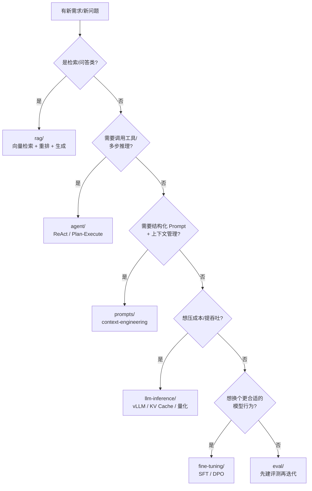

<!--
module:
  number: 09
  slug: ai-applications
  topic: AI Applications（RAG / Agent / Prompt / LLM 推理 / Fine-tuning / Eval）
  audience: AI 应用工程师 / 后端转 AI / 创业团队 / 求职面试者
  category: 主模块
  summary: AI 应用层——RAG、Agent 框架、Prompt 工程、LLM 推理优化、Fine-tuning、Eval 六大主题。
  depth: ⭐
-->

# 09. AI Applications

> **定位**：AI 应用层——RAG、Agent、Prompt、LLM 推理工程、Fine-tuning、Eval。
> **继承规范**：[SPEC.md](./SPEC.md)

## MOC 索引

| # | 主题 | 用途 |
|---|------|------|
| 1 | [rag/](./rag/) | RAG 全景（检索 / rerank / 生成 / 评估 / 生产） |
| 2 | [agent/](./agent/) | Agent 框架（ReAct / Plan-Execute / Multi-Agent） |
| 3 | [prompts/](./prompts/) | Prompt 工程 |
| 4 | [llm-inference/](./llm-inference/) | LLM 推理优化（KV Cache / Flash Attention / Paged） |
| 5 | [fine-tuning/](./fine-tuning/) | 微调方法（SFT / RLHF / DPO） |
| 6 | [eval/](./eval/) | 评估方法 |

## 阅读路径（按场景）

- **从零搭一个 RAG 问答**：[rag/](./rag/) 全景 → [llm-inference/](./llm-inference/) 降本提速 → [eval/](./eval/) 验证效果
- **做生产级 Agent**：[agent/](./agent/) 框架与可靠性 → [prompts/](./prompts/) Prompt 工程 → [eval/](./eval/) 回归评测
- **面试冲刺**：先看各主题 README 的"面试高频题"速查，再按需深入（配套 [12.interview/11.ai](../12.interview/11.ai/) 陷阱版）
- **降本专题**：[agent/agent-context/](./agent/agent-context/) 上下文工程 + [llm-inference/](./llm-inference/) 推理优化

## 主题定位与适用人群

本模块聚焦**"把 LLM 能力变成可上线的应用"**这一段链路,而**不**覆盖模型本身怎么训出来(那是 [08.ai-foundations](../08.ai-foundations/) 的事)。这里的六大子主题可以按"工程关注点"分两组:

| 工程关注点 | 子主题 | 主要回答的问题 |
|-----------|--------|----------------|
| **怎么用好模型**(调用层)| rag / agent / prompts / eval | 怎么搭出能解决具体业务问题的 AI 应用 + 怎么证明它真的有效 |
| **怎么跑得动、跑得便宜**(运行时层)| llm-inference / fine-tuning | 怎么把延迟/吞吐/成本压到生产可接受、怎么用微调换性能 |

**适用人群**:

- ✅ 后端工程师转 AI 应用(Java/Go/Python 后端 + 调 OpenAI/Claude API)
- ✅ 创业团队从 0 搭 AI 产品,需要快速判断"用框架还是自己撸"
- ✅ 在做技术选型报告(给老板/客户解释为什么选 RAG 而不是纯 Prompt)
- ✅ 求职面试者,需要把"RAG / Agent / 上下文工程"讲清楚而不只是背名词

**不适合**:纯算法研究员(模型结构 / 训练范式请去 [08.ai-foundations](../08.ai-foundations/));纯前端开发者(请去 [05.frontend](../05.frontend/))。

## 选型决策树(6 大主题怎么选)

> **口诀**:**"先看是不是检索** → **再看是不是要 Agent** → **最后才想 fine-tune**。直接 fine-tune 是最常见的反模式**(详见下文"常见误区")。

## 阅读路径详解(入门 → 进阶 → 实战)

### 阶段 0:零基础入门(1-2 周)

如果只用过 ChatGPT,没碰过 API:

1. 先读 [prompts/](./prompts/) 入门——理解 System/User Prompt、Few-shot、温度参数
2. 然后读 [rag/](./rag/) 前 2 篇——把"召回"和"生成"两件事分开看
3. 不要急着上 Agent——没有 Prompt 和 RAG 基础,Agent 就是空中楼阁

### 阶段 1:能搭一个能用的 Demo(2-4 周)

1. 完整读 [rag/](./rag/)——从 chunking 到 reranker 的全链路
2. 读 [prompts/context-engineering/](./prompts/context-engineering/)——理解 context window 不是无限的
3. 跑通 [eval/](./eval/) 中的 LLM-as-judge——能定量评估"答得好不好"

### 阶段 2:能上生产(1-3 月)

1. 深读 [agent/](./agent/)——重点看 reliability / production-agent / production-stability
2. 读 [llm-inference/](./llm-inference/)——理解 token 计费、KV Cache、量化带来的成本差
3. 配套 [agent/agent-evaluation/](./agent/agent-evaluation/)——A/B 测试 + 回归评测体系

### 阶段 3:能调优和降本(持续)

- [fine-tuning/](./fine-tuning/)——只在 Prompt + RAG 都压不下去时考虑
- [llm-inference/](./llm-inference/) 进阶——vLLM / 投机解码 / Paged Attention
- [agent/loop-engineering/](./agent/loop-engineering/) / [agent/ontology-driven-agent/](./agent/ontology-driven-agent/)——多 Agent 编排

## 与相邻主题的反向链

- **[08.ai-foundations](../08.ai-foundations/)** — Transformer / LLaMA / 预训练。09 模块的"模型假设"在 08 落地。
- **[03.data-stack](../03.data-stack/)** — 向量数据库 / 缓存 / 大数据处理。RAG 的检索后端几乎都用 03 的基础设施。
- **[06.distributed-systems](../06.distributed-systems/)** — Agent 编排 / 工作流引擎 / 微服务。Agent 在分布式视角看就是一个特殊的分布式系统。
- **[04.spring-backend](../04.spring-backend/)** — Spring AI 在 [agent/ai-platforms/spring-ai-vs-dify](./agent/ai-platforms/spring-ai-vs-dify.md) 中有专门对比,Java 栈团队重点关注。
- **[12.interview/11.ai](../12.interview/11.ai/)** — AI 面试高频 229 题的子目录,与本模块一一对应,适合面试冲刺。

## 常见误区与选型陷阱

1. **❌ 直接 Fine-tune 一个新场景**
   - ✅ 正确顺序:Prompt → RAG → Agent → 微调。90% 的场景只到 Prompt + RAG 就够用。

2. **❌ Agent 能解决一切**
   - ✅ Agent 的"多步推理"会放大不确定性。每一步成功率 90%,三步后只剩 73%。先想清楚能否拆成单步 + 流程编排。

3. **❌ 评估 = 跑几个 demo 看感觉**
   - ✅ 必须有量化指标:[eval/](./eval/) LLM-as-judge + 业务侧 A/B + 回归集。否则"看起来好一点"是错觉。

4. **❌ Token 贵,先压缩 Prompt**
   - ✅ 先看 [llm-inference/](./llm-inference/)——换更便宜的模型 + KV Cache + 批量推理,通常比压 Prompt 收益高 10 倍。

5. **❌ 选 LangGraph / AutoGen / Coze 全凭热度**
   - ✅ 看场景:[agent/ai-platforms/](./agent/ai-platforms/) 有结构化对比。Coze 适合产品经理搭 Demo,LangGraph 适合工程师做复杂编排,Spring AI 适合 Java 栈企业接入。

6. **❌ 把 Context Engineering 等同于"写好 Prompt"**
   - ✅ 见 [prompts/context-engineering/](./prompts/context-engineering/)——除了 Prompt 文本,还包括检索结果、工具定义、对话历史、注意力分配的系统化设计。

## 面试高频 vs 工程实战对照

| 面试高频题(背)|工程实战要点(理解)|
|--------------|-----------------|
| "什么是 RAG?" | RAG 在生产里最大的坑不是"没召回到",而是"召回错的内容让 LLM 自信地胡说"。重点看 reranker 和 lost-in-middle。|
| "ReAct 和 Plan-Execute 区别?" | ReAct 适合步骤不可预测的场景(客服问);Plan-Execute 适合步骤可枚举的场景(数据报表生成)。|
| "KV Cache 是什么?" | KV Cache 是推理成本的核心——长 prompt + 高并发 = 显存爆炸。vLLM 的 Paged Attention 就是为了解决 KV Cache 碎片化。|
| "为什么用 vLLM?" | Continuous Batching + Paged Attention 把吞吐量提升 5-20 倍。生产部署几乎必选 vLLM。|
| "DPO 和 RLHF 区别?" | DPO 不需要单独训练 reward model,实现简单且效果接近。中小团队首选 DPO。|
| "Context Engineering 是什么?" | 比 Prompt 更广——包含检索增强、工具调用 schema、长上下文压缩、注意力焦点管理。[prompts/context-engineering/](./prompts/context-engineering/) 有完整概念图谱。|

> 配套 [12.interview/11.ai/](../12.interview/11.ai/) 有 229 道面试题,带 30 秒话术 / 反直觉 / 陷阱。

## 子主题实战速查表

按"生产上线"为目标,各子主题至少要掌握的 3 个能力:

| 子主题 | 入门 | 进阶 | 实战 |
|--------|------|------|------|
| [rag/](./rag/) | chunking + 检索 + 生成 | reranker + query rewrite | 长文档处理 + 评测回归 |
| [agent/](./agent/) | ReAct 单 Agent | 多 Agent 编排 + Memory | 可靠性 + 工具设计 + 失败恢复 |
| [prompts/](./prompts/) | Few-shot + 温度 | 结构化 Prompt + CoT | Context Engineering 体系化 |
| [llm-inference/](./llm-inference/) | 选模型 + Token 计费 | KV Cache + Flash Attention | vLLM 部署 + 量化 + 投机解码 |
| [fine-tuning/](./fine-tuning/) | 数据集格式 | LoRA + SFT | DPO / 部署 + 推理集成 |
| [eval/](./eval/) | 人工打分 | LLM-as-judge | A/B 框架 + 回归集 + 业务指标 |

---

← [返回 note 总目录](../README.md)