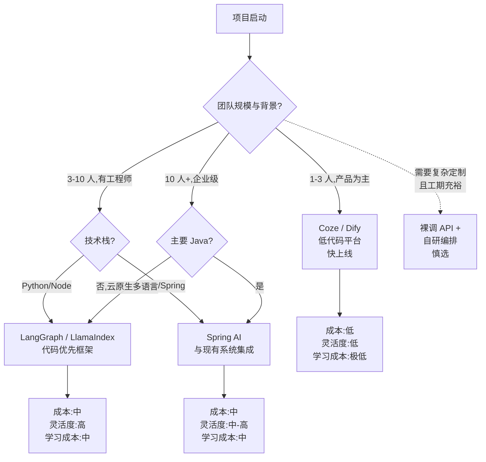
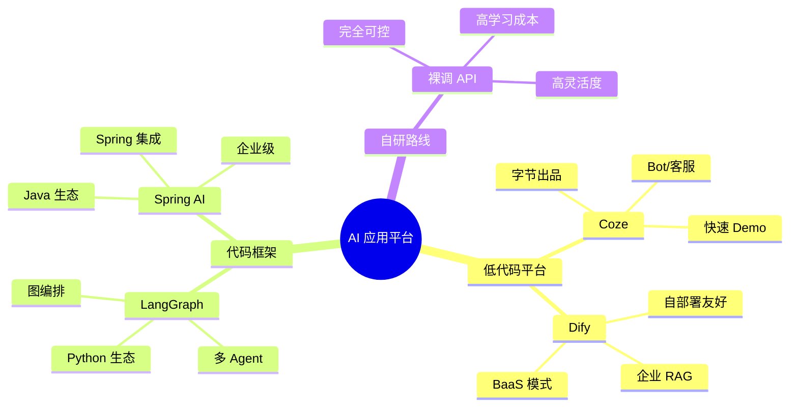

<!--module:
  parent: ai-applications/agent
  slug: ai-applications/agent/ai-platforms
  type: index
  category: AI 应用子 MOC
  summary: AI 平台选型对比——Coze / Dify / LangGraph / Spring AI 等平台定位与适用场景。
  depth: ⭐
-->

# AI 平台（AI Platforms）

> **定位**：主流 AI 应用开发平台选型对比——Coze、Dify、LangGraph、Spring AI 等的定位、特性、适用场景与生态对比。

## 文章清单

| # | 平台/对比 | 路径 | 摘要 |
|---|---------|------|------|
| 1 | Coze | [coze.md](./coze.md) | 字节 Coze 平台定位 / 能力 / 适用场景 |
| 2 | Dify | [dify.md](./dify.md) | Dify 平台定位 / 能力 / 适用场景 |
| 3 | LangGraph | [langgraph.md](./langgraph.md) | LangGraph 框架定位 / 图编排 / 多 Agent |
| 4 | Spring AI vs Dify | [spring-ai-vs-dify.md](./spring-ai-vs-dify.md) | Spring AI 与 Dify 在企业级 AI 应用中的取舍 |
| 5 | Spring AI vs 平台 | [spring-ai-vs-platforms.md](./spring-ai-vs-platforms.md) | Spring AI 与通用 AI 平台的边界 |

---

## 主题定位与适用人群

AI 平台选型是"做 AI 应用"第一道决策——是**用平台**(低代码/可视化)还是**用框架**(代码优先)还是**裸调 API**(完全自研)?

> **本目录不比较模型**(Qwen vs GPT vs Claude),只比较**应用层平台/框架**。模型对比详见各模型厂商文档或 [../../../08.ai-foundations/](../../../08.ai-foundations/)。

**适用人群**:

- ✅ 架构师 / Tech Lead 在做 AI 平台选型报告
- ✅ 后端工程师评估"自家 Java/Python 栈如何接入 LLM"
- ✅ 产品经理评估"用 Coze 能不能 1 周搭出 Demo 给客户看"
- ✅ 创业团队 CTO 决定"自研 LangGraph 还是用 Dify"

**不适合**:纯算法 / 模型研究者;只想调 OpenAI API 写简单脚本的(直接看 [prompts/](../../prompts/) 就够了)。

## 选型决策树(平台 / 框架 / 自研)

> **口诀**:**"快 Demo 选 Coze,做产品选 LangGraph,Java 栈选 Spring AI,特殊场景才自研"**。

## 平台能力矩阵速查

| 平台/框架 | 类型 | 可视化编排 | 知识库/RAG | 多 Agent | 企业集成 | 学习曲线 | 典型场景 |
|----------|------|-----------|-----------|---------|---------|---------|---------|
| **Coze** | 低代码平台 | 强(可视化拖拽) | 内置 | 支持 | 中(主要面向 C 端/中小企业) | 低 | Bot 产品、客服、内部工具 |
| **Dify** | 低代码+BaaS | 强 | 内置 RAG 引擎 | 支持 | 中-高(可自部署) | 低-中 | 企业知识库、智能客服、自部署场景 |
| **LangGraph** | 代码框架(Python) | 弱(图代码) | 需自接 | 强(图原生) | 中 | 中-高 | 复杂 Agent 编排、研究型项目、生产级定制 |
| **Spring AI** | 代码框架(Java) | 弱 | 需自接 | 中 | 强(Spring 生态) | 中(需熟悉 Spring) | Java 栈企业接入、与现有微服务集成 |
| **裸调 API** | 自研 | 无 | 自建 | 自建 | 自建 | 高 | 特殊定制、性能极致优化、深度业务耦合 |

> 详细对比见 [coze.md](./coze.md) / [dify.md](./dify.md) / [langgraph.md](./langgraph.md) / [spring-ai-vs-dify.md](./spring-ai-vs-dify.md) / [spring-ai-vs-platforms.md](./spring-ai-vs-platforms.md)。

## 阅读路径详解

### 阶段 0:零基础(没用过任何 AI 平台)

1. 先读 [coze.md](./coze.md)——可视化最快建立"AI 应用长什么样"的直观感觉
2. 再读 [dify.md](./dify.md)——对比看 RAG 引擎在不同平台的实现差异
3. 试着自己拖一个 Bot 出来

### 阶段 1:工程师开始评估技术栈(1-2 周)

1. 通读 [langgraph.md](./langgraph.md)——理解"代码优先框架"和"可视化平台"的本质区别
2. 如果团队是 Java 栈,重点读 [spring-ai-vs-dify.md](./spring-ai-vs-dify.md) 和 [spring-ai-vs-platforms.md](./spring-ai-vs-platforms.md)
3. 输出选型报告时用本文的"决策树"作为骨架

### 阶段 2:已选型,准备落地(1-2 月)

1. 读 [../agent-context/context-engineering/](../agent-context/context-engineering/)——平台搭骨架,Context Engineering 填血肉
2. 读 [../agent-evaluation/](../agent-evaluation/)——A/B 测试设计,别让平台黑盒掉你的评估能力
3. 读 [../production-agent/](../production-agent/)——平台再好,生产环境的事(监控/告警/降级)还得自己补

## 与相邻主题的反向链

- **[../agent-architecture/](../agent-architecture/)** — Agent 架构的演进史(LLM → ReAct → Plan-Execute → Multi-Agent),帮助你理解平台在抽象哪一层。
- **[../agent-execution-patterns/](../agent-execution-patterns/)** — ReAct / Planning-Acting-Monitoring 等执行模式。LangGraph 直接对应该子模块。
- **[../agent-evaluation/](../agent-evaluation/)** — 选 Coze / Dify 等平台时,最大的隐性成本是"评测能力被平台封装掉"——这里给出 A/B 测试和回归评测的设计。
- **[../production-agent/](../production-agent/)** — 平台抽象了 Happy Path,但生产环境的监控、降级、可靠性得自己补。
- **[../coding-agents/](../coding-agents/)** — 编码 Agent 是 Agent 框架的特殊应用,Spring AI / LangGraph 也常用于 Code Agent。
- **[../../prompts/context-engineering/](../../prompts/context-engineering/)** — Context Engineering 提示词上下文管理,平台也内置了对应的能力,但深度定制需要回到这一层。
- **[../../../08.ai-foundations/](../../../08.ai-foundations/)** — Transformer / LLM 模型基础。理解模型的输入输出和能力边界,才能用好平台。

## 常见误区与选型陷阱

1. **❌ "Coze 够用了,所有项目都用它"**
   - ✅ Coze 适合快速 Demo 和 C 端 Bot,但企业级知识库 / 复杂 Agent 编排 / Java 栈集成会撞墙。需要时切换到 Dify 或 LangGraph。

2. **❌ "Dify = Coze + 更多功能"**
   - ✅ Dify 核心优势是**自部署 + 企业级 RAG 引擎**。如果是 SaaS 快速上线,Coze 更轻;如果要做私有化,Dify 才是首选。

3. **❌ "LangGraph 比 Dify 更先进"**
   - ✅ LangGraph 和 Dify 不是替代关系。LangGraph 是**代码框架**(灵活度高,学习成本高),Dify 是**低代码平台**(灵活性低,上手快)。看团队配置选。

4. **❌ "Spring AI 只适合 Spring 项目"**
   - ✅ Spring AI 现在已支持多种模型 + 向量库 + RAG 助手,适合**任何需要 Java 生态集成**的场景,不只是 Spring 项目。

5. **❌ "选完平台就一劳永逸"**
   - ✅ 平台封装了很多"看不见的能力"——RAG 召回质量、Prompt 模板版本管理、评估体系。**长期看,Prompt 工程、Context Engineering、Eval 这三件事要回到自己手里**。

6. **❌ "可视化拖拽 = 不需要工程师"**
   - ✅ Coze / Dify 的可视化是给工程师**加速**的,不是给产品经理**替代**工程师的。RAG 召回调优、Agent 失败分析、生产监控都需要工程师深度参与。

## 平台能力坐标图(Mermaid mindmap)

## 选型速查表(快速决策版)

把"团队背景 + 业务诉求"压缩成一行决策:

| 你的情况 | 推荐平台/框架 | 理由 |
|---------|---------------|------|
| 产品经理,1 周要给客户看 Demo | Coze | 可视化最快,无需写代码 |
| 创业团队,Python 为主,做企业知识库 | Dify | 自部署 + 内置 RAG + 成本可控 |
| 工程师,需要复杂多 Agent 编排 | LangGraph | 图原生,支持条件分支/循环/多 Agent |
| Java 栈,已有 Spring Cloud 微服务 | Spring AI | 与现有系统无缝集成 |
| 已有 LangChain 代码,想升级到生产 | LangGraph | LangChain 团队出品,平滑迁移 |
| 客户要求私有化部署 | Dify / Spring AI | 二者都支持自部署,LangGraph 需自建 |
| 极致定制,工期充裕 | 裸调 API + 自研编排 | 灵活度最高,但维护成本也最高 |

> **Tip**:选型后立刻配套 [../agent-evaluation/](../agent-evaluation/)——平台选对了,评估体系没跟上,效果好坏就只能靠"老板拍脑袋"。

## 面试高频 vs 工程实战对照

| 面试高频(背) | 工程实战(理解) |
|--------------|----------------|
| "Coze 和 Dify 区别?" | Coze 偏 C 端 Bot,Dify 偏企业 RAG;核心差异是**自部署能力**和**RAG 引擎深度**。 |
| "LangGraph 是什么?" | LangGraph 是 LangChain 团队的状态图框架,**用图(Graph)表达 Agent 流程**,支持条件边、循环、检查点。 |
| "Spring AI 解决了什么?" | Spring AI 把 LLM 调用抽象成 Spring `ChatClient`,统一了不同模型厂商的 API,**对 Java 栈企业接入最友好**。 |
| "可视化平台 vs 代码框架?" | 本质是**抽象层次**差异。可视化平台抽象到"业务流程"层,代码框架抽象到"模型调用"层。越上层越易用,越下层越灵活。 |
| "为什么不用 LangChain 而用 LangGraph?" | LangChain 是"链式调用",LangGraph 是"图编排"。多 Agent / 循环 / 状态恢复必须用 LangGraph 类工具。 |

---

← [返回 Agent](../README.md)
