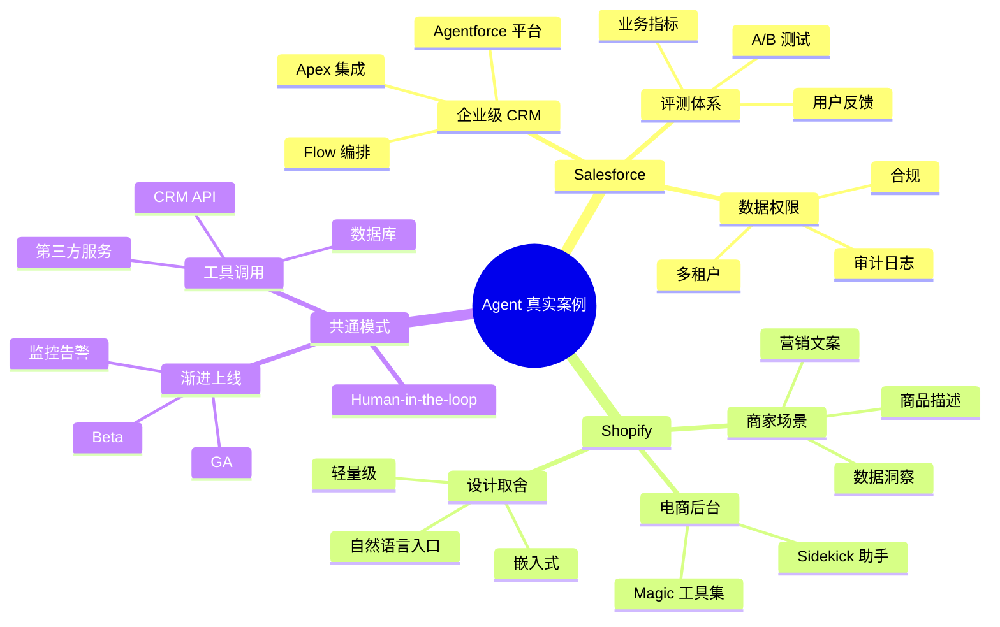

<!--module:
  parent: 09.ai-applications/agent
  slug: 09.ai-applications/agent/case-studies
  type: index
  category: AI 应用子 MOC（案例库）
  summary: Agent 真实企业案例库——Salesforce Agentforce、Shopify AI Agent 等生产级 Agent 落地复盘。
  depth: ⭐
-->

# Agent 真实案例

> **定位**：Agent 真实企业案例库——Salesforce / Shopify 等生产级 Agent 落地复盘，聚焦架构选型与工程踩坑。

## 案例清单

| # | 案例 | 路径 | 摘要 |
|---|------|------|------|
| 1 | Salesforce Agentforce | [salesforce-agentforce/](salesforce-agentforce/README.md) | Salesforce 企业级 Agent 平台（Apex/Flow/Agentforce 集成） |
| 2 | Shopify AI Agent | [shopify-ai-agent/](shopify-ai-agent/README.md) | Shopify Sidekick 商家 AI Agent（Shopify Magic + Sidekick） |

## 阅读路径

1. **先看企业平台**：[Salesforce Agentforce](salesforce-agentforce/README.md) —— 成熟企业级 Agent 平台，适合理解大规模 Agent 编排架构
2. **再看电商实战**：[Shopify AI Agent](shopify-ai-agent/README.md) —— 电商场景 Agent 落地，适合理解 Sidekick 式商家助手的设计取舍

## 关联主题

- [Agent 评测](../agent-evaluation/README.md) —— 案例中均涉及评测体系
- [生产级 Agent](../production-agent/README.md) —— 案例中的工程实践
- [Agent 架构](../architecture/README.md) —— 案例背后的架构选型对比
- [编码 Agent](../coding-agents/README.md) —— 代码生成类 Agent 的工程模式

---

## 主题定位与适用人群

"Agent 真实案例"目录聚焦**已经大规模生产落地**的 AI Agent 产品复盘——不是 Demo、不是 Hackathon 项目,而是日活在百万级、商用 SLA 承诺的产品。

> **本目录不收录**:
> - 论文中的 Agent 框架(去 [../agent-architecture/](../agent-architecture/))
> - 自研小项目(去 [../coding-agents/](../coding-agents/) 看编码 Agent 的工程实践)
> - 模型训练相关案例(去 [../../../08.ai-foundations/](../../../08.ai-foundations/))

**适用人群**:

- ✅ 架构师 / Tech Lead 评估"我们的 AI Agent 能不能上生产、能不能扛 SLA"
- ✅ 产品经理借鉴大厂的 Agent 产品形态(Sidekick / Agentforce 都是可借鉴的成熟模式)
- ✅ 创业团队 CTO 在向投资人/客户讲"我们做的事和大厂一样靠谱"
- ✅ 在做技术选型报告,需要"业界已落地证据"作为论据

**不适合**:纯学术研究者;还在探索 MVP 阶段的早期团队(先看 [../agent-architecture/](../agent-architecture/) 打基础)。

## 阅读路径详解

### 阶段 0:零基础(没用过 Salesforce / Shopify 产品)

1. 先在脑中建立"SaaS 巨头为什么也要做 Agent"的认知:大厂都在把 AI Agent 内嵌到 CRM / ERP / 电商后台,不是赶时髦,是**用户付费意愿**。
2. 通读 [Salesforce Agentforce](salesforce-agentforce/README.md)——了解**企业级 Agent 平台**的复杂度(权限、数据、流程编排、审计)。
3. 再读 [Shopify AI Agent](shopify-ai-agent/README.md)——对比**商家助手**这类"轻量级 Agent"的不同设计取舍。

### 阶段 1:在做自家 Agent 产品的设计

1. 把两个案例的"目标用户 / 触发场景 / 工具集 / 评估指标"对照自己产品做映射。
2. 关注每个案例的**架构图**(通常在 README 顶部)——观察它们如何组织 Agent、工具、人审(human-in-the-loop)。
3. 对照 [../agent-architecture/](../agent-architecture/) 的 Agent 演进史,看案例用的是哪一代架构。

### 阶段 2:准备上线 / 已上线 / 出问题

1. 重读案例中的"踩坑"章节(通常以 `❌` `⚠️` 标记)——直接复用工程经验。
2. 对照 [../production-agent/](../production-agent/) 和 [../production-stability/](../production-stability/)——大厂踩过的坑,生产稳定性模块都有系统化总结。
3. 配合 [../agent-evaluation/](../agent-evaluation/) 建立回归评测集——案例中均涉及。

## 与相邻主题的反向链

- **[../agent-architecture/](../agent-architecture/)** — Agent 架构演进史。理解案例用了哪代架构(单 Agent / 多 Agent / Agent Mesh)。
- **[../agent-execution-patterns/](../agent-execution-patterns/)** — ReAct / Plan-Execute / Planning-Acting-Monitoring 等执行模式。案例中的 Agent 行为都可以映射到这些模式。
- **[../agent-evaluation/](../agent-evaluation/)** — 案例中均涉及评测体系。LLM-as-judge、A/B 测试、回归集这套体系是上生产的必备。
- **[../production-agent/](../production-agent/)** — 大厂案例的工程实践:监控、降级、限流、成本控制。
- **[../coding-agents/](../coding-agents/)** — 编码 Agent 是 Agent 框架的特殊应用。Salesforce Agentforce 也涉及代码生成能力。
- **[../ai-platforms/](../ai-platforms/)** — 平台选型参考。Agentforce 与 Coze / Dify / LangGraph 在抽象层次上完全不同。

## 案例能力坐标图(Mermaid mindmap)

## 案例对比速查表

| 维度 | Salesforce Agentforce | Shopify AI Agent |
|------|----------------------|-------------------|
| **目标用户** | 企业销售 / 客服 / IT | 电商商家 |
| **使用场景** | CRM 数据洞察、自动跟进、工单处理 | 商品描述、营销文案、店铺运营 |
| **Agent 类型** | 多 Agent + 编排平台 | 单 Agent + 工具集 |
| **集成复杂度** | 高(企业 IT 系统) | 中(Shopify 生态) |
| **数据敏感度** | 极高(客户数据) | 中-高(店铺数据) |
| **评估指标** | 销售转化、工单 SLA | 商家采纳率、GMV 提升 |
| **典型踩坑** | 权限边界、数据治理 | 商家教育、Prompt 偏见 |
| **可借鉴到** | 任何"内部系统 + AI"场景 | 任何"用户后台 + AI 助手"场景 |

## 选型与借鉴建议

如果你正在做类似场景的 Agent 产品,**不要从 0 重新设计**,而是参考这两个案例的:

1. **用户入口设计**:Sidekick 用自然语言 + 表单混合入口,Agentforce 用"侧边栏 + AI 建议"。你的产品形态决定入口。
2. **工具集设计**:Agentforce 的工具集围绕 CRM 对象(Account / Opportunity / Lead),Sidekick 的工具集围绕 Shopify 对象(Product / Order / Inventory)。**先列你的领域对象,再设计工具**。
3. **Human-in-the-loop**:两个案例都有"AI 建议 + 人工确认"模式。**任何会改用户数据的操作,都必须有人审环节**。
4. **渐进式上线**:两个案例都从 Beta 到 GA,逐步扩大用户范围。**不要全量上线**,先 5% 用户跑 1 个月。

## 扩展阅读与延伸主题

当案例不够用时,按以下顺序扩展你的认知:

- **[../architecture/](../architecture/)** — Agent 架构选型对比(单 Agent vs 多 Agent vs Agent Mesh)
- **[../agent-memory/](../agent-memory/)** — 长记忆 / 短期上下文 / 知识库检索,案例中 Agent 的"记性"是怎么设计的
- **[../agent-reliability/](../agent-reliability/)** — 失败重试、超时控制、降级策略,案例背后"生产不挂"是怎么做到的
- **[../loop-engineering/](../loop-engineering/)** — Agent 循环的工程化,关注"几步之后成功率下降到不能接受"这个问题

---

← [返回 Agent MOC](../README.md)
