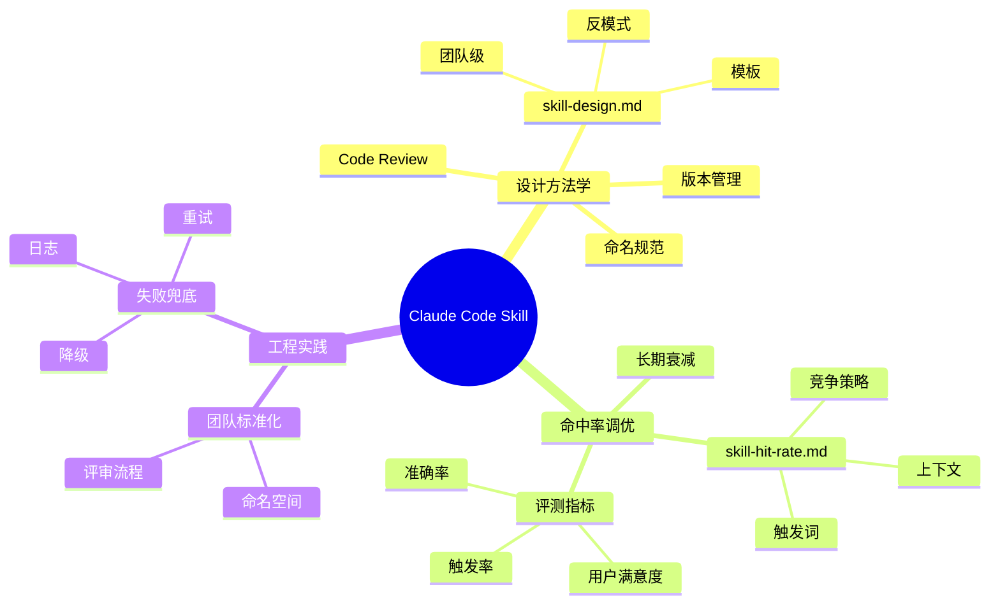

<!--module:
  parent: ai-applications/agent/coding-agents
  slug: ai-applications/agent/coding-agents/claude-code-practices
  type: index
  category: AI 应用子 MOC
  summary: Claude Code 工程实践——Skill 设计方法学 / Skill 命中率调优 2 大主题。
  depth: ⭐
-->

## 📍 一句话定位

> Claude Code 实战（CLI/插件/Skills 集成与生产经验）
# Claude Code 实践（Claude Code Practices）

> **定位**：Claude Code 工程实践——Skill 设计方法学与 Skill 命中率调优。

## 文章清单

| # | 主题 | 路径 | 摘要 |
|---|------|------|------|
| 1 | Skill 设计 | [skill-design.md](./skill-design.md) | Claude Code Skill 的设计方法、模板与反模式 |
| 2 | Skill 命中率 | [skill-hit-rate.md](./skill-hit-rate.md) | Skill 命中率调优——触发词、上下文与策略 |

---

## 主题定位与适用人群

本目录聚焦 **Claude Code**(Anthropic 官方 CLI 编码 Agent)**在真实项目中的工程实践**——不是介绍 Claude Code 怎么用(B 站视频一大堆),而是**怎么把 Claude Code 用到生产级 / 团队级 / 长链路工程**。

> **本目录不收录**:
> - Claude Code 入门教程(请看 [../../08.ai-foundations/](../../../../08.ai-foundations/) 中的相关章节,或 Claude Code 官方文档)
> - 其他编码 Agent 的对比(去 [../README.md](../README.md) 父目录看 Claude Code vs Codex vs OpenCode vs OMP)
> - Prompt 通用工程(去 [../../../prompts/](../../../prompts/))

**适用人群**:

- ✅ Claude Code 重度用户——已经把 Claude Code 当主力 IDE 的工程师
- ✅ 团队 Lead——想给团队配一套 Claude Code 工作流(Skill 模板 / 触发词 / 评审流程)
- ✅ Skill 作者——正在写或维护 Claude Code Skill,想提升 Skill 命中率
- ✅ AI 工程化实践者——关注"Agent 在工程团队里如何标准化"

**不适合**:刚开始用 Claude Code 的新手(先去 [../README.md](../README.md) 看编码 Agent 全景);非编码类 Agent 实践者(去 [../../agent-architecture/](../../agent-architecture/))。

## 阅读路径详解

### 阶段 0:还没用过 Claude Code Skill

1. 先读 [../README.md](../README.md)——理解 Claude Code 在编码 Agent 圈的位置
2. 再读 Claude Code 官方文档的 Skill 部分(本目录不重复官方内容)
3. 然后回到这里读 [skill-design.md](./skill-design.md)——带着"我想写一个 Skill"的明确目标

### 阶段 1:写第一个 Skill(1-2 天)

1. 通读 [skill-design.md](./skill-design.md)——按里面的方法学 + 模板写第一版
2. 写完跑 [skill-hit-rate.md](./skill-hit-rate.md) 第一阶段——统计"用户触发 Skill 的次数 / 总可能触发次数",作为基线
3. 用 5-10 个真实场景测试,记录 Skill 是否被触发、回答是否准确

### 阶段 2:Skill 进入团队使用(1-2 周)

1. 重读 [skill-design.md](./skill-design.md) 中的"团队级设计"部分——考虑命名空间、版本管理、冲突处理
2. 读 [skill-hit-rate.md](./skill-hit-rate.md) 的"调优策略"——结合团队反馈做触发词/上下文的优化
3. 配套 [../../agent-evaluation/](../../agent-evaluation/)——建立 Skill 命中率和回答准确率的回归评测

### 阶段 3:Skill 长期维护(月级)

- 把 Skill 当代码管理:版本号、Code Review、Changelog、Deprecation
- 持续观察 [skill-hit-rate.md](./skill-hit-rate.md) 提到的"长期衰减"问题——Claude Code 行为或底层模型升级会改变 Skill 有效性

## 与相邻主题的反向链

- **[../README.md](../README.md)** — 编码 Agent 全景,Claude Code / Codex / OpenCode / OMP 的定位对比。
- **[../../agent-architecture/](../../agent-architecture/)** — Skill 在 Agent 架构里本质是"提示词/能力的模块化封装",理解架构才能理解 Skill 的位置。
- **[../../agent-context/](../../agent-context/)** — Skill 命中率的核心影响因素之一是"上下文竞争"。多个 Skill 在同一上下文中如何分配注意力。
- **[../../agent-reliability/](../../agent-reliability/)** — Skill 失败时如何降级 / 兜底 / 重试,是 Agent 可靠性的子问题。
- **[../claude-code.md](../claude-code.md)** — Claude Code 编码 Agent 本身的介绍(在本目录的父级)。
- **[../../../prompts/context-engineering/](../../../prompts/context-engineering/)** — Skill 的设计本质是 Context Engineering 的一个具体应用。
- **[../../../../08.ai-foundations/](../../../../08.ai-foundations/)** — Claude Code 底层模型的能力边界,决定 Skill 能做什么、不能做什么。

## 能力坐标图(Mermaid mindmap)

## Skill 设计 vs 命中率调优对照表

| 维度 | Skill 设计 | Skill 命中率 |
|------|-----------|--------------|
| **核心问题** | "这个 Skill 写得好不好?" | "这个 Skill 会被触发吗?" |
| **衡量指标** | 模板完整性、文档质量、可读性 | 触发率(被触发次数 / 应被触发次数) |
| **典型优化** | 模板重构、命名清晰、示例丰富 | 触发词调整、上下文压缩、优先级设置 |
| **常见反模式** | 大而全的 Skill 难以维护 | 触发词太泛导致互相冲突 |
| **何时关注** | Skill 写完 / 大改后 | 上线后持续观察 |
| **失败症状** | 团队不愿用 / 维护成本高 | 用了但效果差 / 不该触发时触发 |
| **配套模块** | [../../agent-architecture/](../../agent-architecture/) | [../../agent-evaluation/](../../agent-evaluation/) |

## 实战建议(速查版)

按你的角色选最相关的章节:

- **🎯 第一次写 Skill**:只读 [skill-design.md](./skill-design.md),先做"能用的最小版本"
- **🔧 Skill 命中率低**:直接跳到 [skill-hit-rate.md](./skill-hit-rate.md),从触发词开始调
- **👥 要给团队铺**:先 [skill-design.md](./skill-design.md) 的"团队级"章节,再看 [skill-hit-rate.md](./skill-hit-rate.md) 的"评测"章节
- **📉 Skill 用了一段时间失效**:先 [skill-hit-rate.md](./skill-hit-rate.md) 的"长期衰减"部分,再考虑 Skill 重构

## 常见误区速览(选读)

1. **❌ "Skill 写得很全,自然有人用"**
   - ✅ Skill 必须有清晰触发词 + 简明说明,否则在上下文竞争中输给别人。

2. **❌ "Skill 命中率低是 Prompt 问题"**
   - ✅ 命中率更多取决于**触发词设计**和**上下文管理**,Prompt 措辞的影响小于前两者。

3. **❌ "一个 Skill 包打天下"**
   - ✅ Skill 应该**小而专**,每个 Skill 解决一个明确问题。大而全的 Skill 维护成本高、命中率低。

4. **❌ "Skill 是 Claude Code 专属概念"**
   - ✅ Skill 本质是"Agent 能力的模块化封装",Coze / Dify / LangGraph 都有类似概念(如 Coze 的 Plugin、Dify 的工具节点)。

## 配套资源

- **官方文档**:Claude Code 官方文档中的 Skill / SubAgent 章节(Claude Code 官方持续更新,以官方为准)
- **团队 Skill 模板库**:建议团队内部维护一份 Skill 模板 + 评审 checklist
- **回归评测集**:每个核心 Skill 配 5-10 个真实场景的测试用例,作为回归基准

---

← [返回 coding-agents](../README.md)
