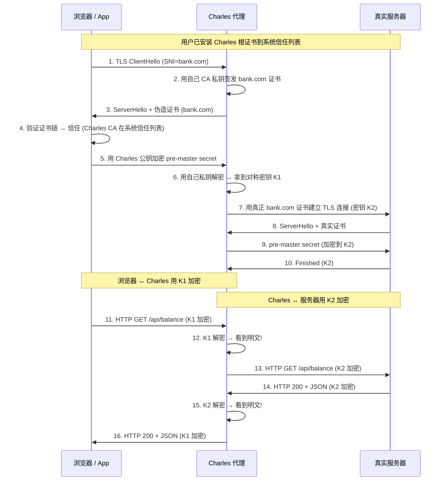

<!--
question:
  id: 05.security-https-mitm-and-pinning
  topic: 05.security
  difficulty: ⭐⭐⭐⭐⭐
  frequency: 高频
  scenario_type: 安全边界
  tags: [05.security, HTTPS, MITM, SSL Pinning, Charles, Fiddler, mTLS, ATS, Network Security Config]
-->

# HTTPS 能不能防抓包？—— 安全边界、Charles 抓包原理与 SSL Pinning 5 方案

> 一句话定位：HTTPS 防的是**被动窃听 / 篡改 / 身份冒充**，但**防不了用户主动授权的 MITM**——Charles 抓 HTTPS 不是破解加密，而是合法的中间人代理。完整 TLS 协议见 [主模块加密通信](../../../06.distributed-systems/05-security/encryption/README.md)。

> **系列定位**：经典移动端 + 后端安全面试题（字节 / 阿里 / 美团高频）。考察 **HTTPS 防御边界认知** + **MITM 抓包原理** + **SSL Pinning 5 大方案** + **6 大反直觉点**。

---

## 引子：老板让你从零设计一个 HTTPS 客户端，能保证不被抓包吗？

```text
场景还原（金融 App 逆向实战）：
1. 产品上线 3 天，安全团队反馈"我们的 HTTPS 通信能被 Charles 抓到明文"
2. 研发甩出代码："我们用了 HTTPS + TLS 1.3 + AES-256-GCM，肯定安全"
3. 安全团队演示：
   - 测试机安装 Charles 根证书
   - 用户首次打开 App 时被弹窗"是否信任此证书？"
   - 信任后 → Charles 作为中间人代理 → HTTP 头、Body、Token、Cookie 全是明文
4. 研发懵了：HTTPS 不是端到端加密吗？Charles 凭什么能看到？
```

**反直觉核心**：HTTPS 的"端到端加密"指的是**浏览器 ↔ 服务器**两端，**不包括用户自己安装的根证书**。Charles 是**用户主动授权的中间人**，不是"破解加密"——它有自己的 CA 私钥，能给浏览器签发"合法"证书。

**本篇要回答的 4 个核心问题**：
1. HTTPS 到底防什么、防不了什么？
2. Charles / Fiddler 抓 HTTPS 的 3 步原理是什么？
3. SSL Pinning 的 5 大方案怎么选？
4. 加了 Pinning 为什么还是被绕过？（Frida Hook）

---

## 一、核心原理：HTTPS 防什么 vs 防不了什么

### 1.1 HTTPS 能防的 3 类攻击

| 攻击类型 | 防御机制 | 举例 |
|---------|---------|------|
| **被动窃听** | 对称加密（AES-256-GCM）保机密性 | 咖啡厅 WiFi 抓包看不到明文 |
| **数据篡改** | HMAC + AEAD 完整性校验 | 中间人无法修改 HTTP 响应而不被发现 |
| **身份冒充** | 数字证书 + CA 链验证 | 攻击者无法伪造 bank.com 证书 |

**TLS 1.2 / 1.3 握手流程回顾**（详见 [https-handshake](../https-handshake/README.md)）：客户端验证服务器证书链 → 用服务器公钥加密 pre-master secret → 双方派生出对称密钥 → 所有 HTTP 数据 AES 加密。

### 1.2 HTTPS 防不了的 5 类攻击（核心反直觉）

#### 攻击 1：用户主动授权的 MITM（最核心反直觉）

```text
攻击流程：
1. 用户主动安装 Charles / Fiddler 根证书（信任为 CA）
2. 用户配置系统代理 127.0.0.1:8888
3. 浏览器发起 HTTPS 请求 → Charles 截获
4. Charles 用自己的 CA 私钥签发"bank.com"证书发给浏览器
5. 浏览器验证证书链 → 信任（因为 Charles 根证书在系统信任列表）
6. 浏览器用 Charles 的公钥加密 pre-master secret
7. Charles 用自己的私钥解密 → 拿到对称密钥
8. Charles 重新用真正的 bank.com 证书与服务器建立 TLS 连接
9. Charles 作为中间人：浏览器 ↔ Charles ↔ 服务器，全程可解密
```

**关键**：Charles 不是"破解加密"，而是被**用户授权的 CA**——操作系统信任链里**多了一个你主动加进去的根证书**。

#### 攻击 2：客户端环境被控（root / 越狱 + 反编译 + Frida Hook）

```text
攻击场景：
- Android root 后注入系统证书库
- iOS 越狱后用 Frida 拦截 SSL_CTX_set_verify
- 反编译 APK 用 Xposed / Magisk 模块 Hook TrustManager
→ 即使 SSL Pinning 也形同虚设
```

**核心**：Pinning 信任的是"代码不会被改"，但客户端环境被攻陷后，**所有客户端防护都失效**。

#### 攻击 3：CA 信任链被破坏

| 事件 | 年份 | 影响 |
|------|------|------|
| **DigiNotar 破产** | 2011 | 黑客签发 531 个伪造证书（含 google.com、microsoft.com），触发 Chrome 全量吊销 |
| **CNNIC 事件** | 2015 | CNNIC 滥用 MCA 子证书签发假证书，Chrome / Firefox 移除信任 |
| **Symantec 失误** | 2017-2018 | 错误签发 3 万张证书，Chrome 不再信任 |
| **Let's Encrypt 误签** | 2020 | 90% 的 Let's Encrypt 证书因 CAA bug 需重新签发 |

**反直觉**：CA 体系本身是**社会信任链**，攻击者不需要破解数学，只需要获得一个**合法的 CA 证书**。

#### 攻击 4：协议降级攻击

| 攻击名 | 年份 | 利用漏洞 | 防御 |
|--------|------|---------|------|
| **POODLE** | 2014 | SSL 3.0 CBC 填充 | 禁用 SSL 3.0 |
| **DROWN** | 2016 | SSL 2.0 漏洞回放 RSA 密钥交换 | 禁用 SSL 2.0 / SSL 3.0 |
| **BEAST** | 2011 | TLS 1.0 CBC 模式 IV 可预测 | 升级 TLS 1.1+ |
| **Sweet32** | 2016 | 64 位分组密码碰撞（3DES） | 禁用 3DES |
| **FREAK** | 2015 | 强制降级到 512 位 RSA 出口级 | 禁用出口级套件 |
| **Logjam** | 2015 | 512 位 DH 密钥可预计算 | 1024 位以上 DH |

#### 攻击 5：加密算法脆弱性（退场时间线）

```text
算法退场时间线：
  1995: SSL 2.0 → 1996 弃用（设计缺陷）
  1996: SSL 3.0 → 2014 POODLE 后弃用
  2006: TLS 1.0 → 2018（PCI DSS）禁用 / 2020（主流浏览器）
  2008: TLS 1.1 → 2020 主流浏览器禁用
  2018: TLS 1.3 → 当前主流
  2017: SHA-1 → Chrome 2017 起不再信任
  2015: RC4 → 2015 RFC 7465 禁用
  2016: 3DES → 2016 Sweet32 后弃用
  2019: RSA-1024 → 主流 CA 不再签发

现状（2026）：TLS 1.2 + TLS 1.3 共存，1.3 优先；SHA-256/384 + ECDHE + AES-256-GCM/ChaCha20-Poly1305
```

---

## 二、Charles / Fiddler 抓包原理详解

### 2.1 抓包 3 步流程

```text
Step 1: 配置 HTTP 代理
  Charles → 监听 127.0.0.1:8888
  系统 / 浏览器 → 代理设为 127.0.0.1:8888

Step 2: 安装用户证书（关键）
  Charles 根证书导出 → 用户双击安装 → 添加到系统信任的 CA 列表
  iOS: 设置 → 通用 → VPN 与设备管理 → 信任证书
       设置 → 通用 → 关于本机 → 证书信任设置 → 启用
  Android: 设置 → 安全 → 从设备存储安装 → 凭据用途选"VPN和应用"

Step 3: 解密 HTTPS
  浏览器请求 bank.com → Charles 截获
  Charles 用自己的 CA 私钥签发 bank.com 证书 → 发给浏览器
  浏览器验证通过（用户信任了 Charles CA） → 用 Charles 公钥加密
  Charles 私钥解密 → 看到明文 → 转发给真正的 bank.com
```

### 2.2 Charles 证书链流程图



### 2.3 抓包能看到什么 vs 抓不到什么

| 类别 | 抓包可见 | 抓包不可见 |
|------|---------|-----------|
| **HTTP 头** | ✅ 完整可见（Host / Cookie / Authorization） | ❌ - |
| **HTTP Body** | ✅ JSON / Form 明文 | ❌ - |
| **Cookie / Token** | ✅ Set-Cookie / Authorization 头 | ❌ - |
| **SSL Pinning 校验失败的请求** | ❌ - | ✅ 连接直接断开 |
| **mTLS 客户端证书** | ❌ Charles 无法持有客户端私钥 | ✅ - |
| **客户端二次加密字段** | ❌ - | ✅ 即使抓到密文也无法解密 |

### 2.4 抓包工具对比

| 工具 | 平台 | 特色 |
|------|------|------|
| **Charles** | macOS / Windows / Linux | HTTPS 抓包标配 + Rewrite / Map Local / Throttle |
| **Fiddler** | Windows / macOS | .NET 生态 + 脚本化扩展 |
| **mitmproxy** | 全平台 | Python 脚本 + 中间人代理（适合自动化测试） |
| **Burp Suite** | 全平台 | 安全测试 + 主动扫描 + Intruder 爆破 |
| **Wireshark** | 全平台 | 抓网络层包，看不到解密后的 HTTPS 内容（除非有 session keys） |

---

## 三、SSL Pinning 防御方案（5 大方案）

### 3.1 方案对比总览

| 方案 | 防御强度 | 证书续期 | 部署复杂度 | 适用场景 |
|------|---------|---------|-----------|---------|
| **证书绑定**（Certificate Pinning） | ⭐⭐⭐⭐⭐ | ❌ 续期需更新 | 低 | 强安全需求 |
| **公钥绑定**（Public Key Pinning） | ⭐⭐⭐⭐⭐ | ✅ 兼容 | 低 | 长期稳定 |
| **双向认证**（mTLS） | ⭐⭐⭐⭐⭐ | ✅ 兼容 | 高 | 金融 / 政企 / IoT |
| **iOS ATS** | ⭐⭐⭐ | ✅ 自动 | 极低 | 所有 iOS App |
| **Android Network Security Config** | ⭐⭐⭐ | ✅ 自动 | 低 | API 24+ Android |

### 3.2 方案 1：证书绑定（Certificate Pinning）

```kotlin
// Android OkHttp Certificate Pinning
val client = OkHttpClient.Builder()
    .certificatePinner(
        CertificatePinner.Builder()
            .add("api.bank.com", 
                 "sha256/AAAAAAAAAAAAAAAAAAAAAAAAAAAAAAAAAAAAAAAAAAA=")
            .add("api.bank.com", 
                 "sha256/BBBBBBBBBBBBBBBBBBBBBBBBBBBBBBBBBBBBBBBBBBB=") // 备份证书
            .build()
    )
    .build()

// 校验流程：
// 1. 收到服务器证书
// 2. 计算公钥 SHA-256 hash
// 3. 与配置的 hash 列表比对
// 4. 不匹配 → 抛出 SSLPeerUnverifiedException
```

**缺点**：证书续期（rotate）必须发版 App——**业务灵活性差**。

### 3.3 方案 2：公钥绑定（Public Key Pinning，更稳）

```text
核心思想：绑定证书的公钥（SubjectPublicKeyInfo），不绑定整个证书。
原因：证书续期时 CA 可能重新签发，但只要私钥不变，公钥 hash 就不变。
```

```nginx
# Nginx 配置公钥 Pinning（HTTP Public Key Pinning）
add_header Public-Key-Pins 'pin-sha256="base64=="; max-age=5184000; includeSubDomains' always;
```

**演进**：HPKP 已被主流浏览器废弃（2018 Chrome 弃用），因为配置错误会导致网站无法访问。但**移动端 / 桌面端 App 内 Pinning 仍有效**。

### 3.4 方案 3：双向认证（mTLS — 终极方案）

```text
普通 HTTPS：服务器证书 → 客户端验证服务器身份
mTLS：       服务器证书 + 客户端证书 → 双方互相验证身份
```

```nginx
# Nginx 启用 mTLS
server {
    ssl_client_certificate /path/to/ca.crt;     # 验证客户端证书的 CA
    ssl_verify_client on;                       # 强制验证客户端证书
    ssl_verify_depth 2;
}
```

```java
// 客户端加载客户端证书
KeyStore keyStore = KeyStore.getInstance("PKCS12");
keyStore.load(new FileInputStream("client.p12"), "password".toCharArray());

KeyManagerFactory kmf = KeyManagerFactory.getInstance("SunX509");
kmf.init(keyStore, "password".toCharArray());

SSLContext sslContext = SSLContext.getInstance("TLSv1.3");
sslContext.init(kmf.getKeyManagers(), null, null);
```

**应用场景**：银行 B2B API、政企专网、IoT 设备接入、Service Mesh（Istio 自动管理）。

### 3.5 方案 4：iOS ATS（App Transport Security）

```swift
// iOS 默认行为（iOS 9+）：
// - 强制 HTTPS
// - 禁用 HTTP 明文
// - 要求 TLS 1.2+
// - 要求前向安全加密套件（ECDHE）
// - 要求 SHA-256 证书签名

// 关闭 ATS 例外配置（不推荐生产用）
<dict>
    <key>NSAppTransportSecurity</key>
    <dict>
        <key>NSAllowsArbitraryLoads</key>
        <false/>  <!-- 严格模式 -->
        <key>NSExceptionDomains</key>
        <dict>
            <key>internal-api.example.com</key>
            <dict>
                <key>NSExceptionAllowsInsecureHTTPLoads</key>
                <true/>
                <key>NSIncludesSubdomains</key>
                <true/>
            </dict>
        </dict>
    </dict>
</dict>
```

**关键约束**：iOS 默认**不信任用户安装的证书**（信任需手动开启：设置 → 通用 → 关于本机 → 证书信任设置）。这是 ATS 的核心防御点。

### 3.6 方案 5：Android Network Security Config（API 24+）

```xml
<!-- res/xml/network_security_config.xml -->
<?xml version="1.0" encoding="utf-8"?>
<network-security-config>
    <!-- 默认：信任系统 CA + 不信任用户 CA -->
    <base-config cleartextTrafficPermitted="false">
        <trust-anchors>
            <certificates src="system"/>
            <!-- 关键：默认不包含 user 证书源 -->
        </trust-anchors>
    </base-config>
    
    <!-- 生产域名：额外绑定证书 -->
    <domain-config>
        <domain includeSubdomains="true">api.bank.com</domain>
        <pin-set expiration="2027-01-01">
            <pin digest="SHA-256">AAAA...AAAA=</pin>
            <pin digest="SHA-256">BBBB...BBBB=</pin>  <!-- 备份 -->
        </pin-set>
    </domain-config>
    
    <!-- 调试环境：允许用户证书（仅 debug buildType） -->
    <debug-overrides>
        <trust-anchors>
            <certificates src="system"/>
            <certificates src="user"/>  <!-- 仅 debug 信任 -->
        </trust-anchors>
    </debug-overrides>
</network-security-config>
```

```xml
<!-- AndroidManifest.xml 中引用 -->
<application
    android:networkSecurityConfig="@xml/network_security_config"
    android:usesCleartextTraffic="false">
</application>
```

---

## 四、6 大反直觉点

### 反直觉 1：HTTPS 防不了"用户主动授权"的 MITM（核心反直觉）

```text
❌ 错误认知：HTTPS 是端到端加密，绝对安全
✅ 真相：HTTPS 的"端到端"指的是浏览器 ↔ 服务器，不包括用户安装的根证书
   → 用户信任 Charles CA = 用户授权 Charles 做 MITM
   → 这是"合法中间人"，不是"破解加密"
```

### 反直觉 2：Charles 抓 HTTPS 不是"破解加密"

```text
❌ 错误认知：Charles 破解了 AES-256
✅ 真相：Charles 根本没有碰 AES-256，它做的是：
   1. 用自己的 CA 私钥签发 bank.com 证书（合法证书链）
   2. 浏览器验证证书链通过 → 信任 Charles
   3. 浏览器把对称密钥发给 Charles（不是发给服务器）
   4. Charles 拿着对称密钥解密数据
   → 本质是"在合法通道里成为新的端点"，不是破解数学
```

### 反直觉 3：iOS 默认不信任用户证书

```text
❌ 错误认知：iOS 和 Android 一样，安装证书就能抓包
✅ 真相：iOS 7+ 起，用户证书默认不受信任
   → 安装 Charles 证书到 iPhone 后，必须手动开启：
     设置 → 通用 → VPN 与设备管理 → 选择证书 → 安装
     设置 → 通用 → 关于本机 → 证书信任设置 → 启用
   → 这个"额外一步"是 iOS 的核心防御
```

### 反直觉 4：SSL Pinning 加了但配置错误 = 没加

```text
常见错误 1：用 certificatePinner 但没校验 chain
  → 攻击者可以用任意证书通过 chain 校验
  → 正确做法：必须 verify full chain 到 root

常见错误 2：native 层配 Pinning 但 Java 层无校验
  → Android 上很多库用 WebView / HttpURLConnection 走 Java SSL
  → 攻击者用 Frida Hook TrustManager 绕过
```

**Frida Hook 绕过示例**：

```javascript
// Frida 脚本：绕过 SSL Pinning（Objection / ssl-kill-switch2 工具内置）
Java.perform(function() {
    var TrustManagerImpl = Java.use('com.android.org.conscrypt.TrustManagerImpl');
    TrustManagerImpl.verifyChain.implementation = function() {
        console.log('[+] SSL Pinning bypassed!');
        return arguments[0]; // 直接返回，不校验
    };
});
```

**防御反绕过**：
- **Native 层校验**（C/C++ 调用 OpenSSL，比 Java 层更难 Hook）
- **证书链双向校验**（客户端也校验 intermediate）
- **运行时完整性检测**（检测 Frida / Xposed / Magisk）
- **关键密钥放 HSM**（即使客户端被攻陷，密钥也不泄露）

### 反直觉 5：双向认证（mTLS）才是真正的端到端安全

```text
普通 HTTPS：
  服务器 ← 客户端证书？没有
  客户端身份认证靠：Cookie / Token / JWT
  → Cookie 被偷 = 身份被冒充（XSS / CSRF）

mTLS：
  客户端 ↔ 服务器 双向证书认证
  客户端私钥保护 → 即使 Token 泄露，攻击者无客户端证书仍无法连接
  → 金融、政企、IoT 的标配
```

### 反直觉 6：Let's Encrypt 普及后 CA 攻击成本反而降低

```text
❌ 反直觉：CA 普及 = 攻击更难？
✅ 真相：
  - 攻击者不再需要破解 CA 信任链
  - 攻击者可以用 Let's Encrypt 申请任意域名的合法证书（只需证明域名所有权）
  - 域名劫持 / DNS 污染 + Let's Encrypt = 合法 MITM 证书
  - 2019 Let's Encrypt 因 CAA bug 误签 3% 证书事件证明：CA 自动化也有风险
  - 防御：HPKP 已废，移动端 Pinning 仍是关键
```

---

## 五、实战代码示例

### 5.1 OkHttp + CertificatePinner（Android）

```kotlin
// 1. 生成证书 SHA-256 hash
// openssl s_client -connect api.bank.com:443 | openssl x509 -pubkey -noout | \
//   openssl pkey -pubin -outform der | openssl dgst -sha256 -binary | base64

// 2. 配置 Pinning
val pinner = CertificatePinner.Builder()
    .add("api.bank.com",
         "sha256/YLh1dUR9y6Kja30RrAn7JKnbQG/uEtLMkBgFF2Fuihg=")
    .add("api.bank.com",
         "sha256/sRHdihwgkaib1P1gN7SkKPjVLmNpQ7YCMoUD9oG/0n0=")  // 备份
    .build()

val client = OkHttpClient.Builder()
    .certificatePinner(pinner)
    .connectTimeout(10, TimeUnit.SECONDS)
    .build()

// 3. 抓包测试（用 Charles 抓）
// 报错：javax.net.ssl.SSLPeerUnverifiedException: Certificate pinning failure!
//   Peer certificate chain: sha256/...
//   Pinned certificates for api.bank.com: sha256/YLh1...
```

### 5.2 iOS URLSession Pinning

```swift
// URLSessionDelegate 拦截证书校验
class PinningURLSessionDelegate: NSObject, URLSessionDelegate {
    let pinnedHashes: Set<String> = [
        "YLh1dUR9y6Kja30RrAn7JKnbQG/uEtLMkBgFF2Fuihg=",
        "sRHdihwgkaib1P1gN7SkKPjVLmNpQ7YCMoUD9oG/0n0="
    ]
    
    func urlSession(_ session: URLSession,
                    didReceive challenge: URLAuthenticationChallenge,
                    completionHandler: @escaping (URLSession.AuthChallengeDisposition, URLCredential?) -> Void) {
        guard challenge.protectionSpace.authenticationMethod == NSURLAuthenticationMethodServerTrust,
              let serverTrust = challenge.protectionSpace.serverTrust else {
            completionHandler(.cancelAuthenticationChallenge, nil)
            return
        }
        
        // 获取服务器证书公钥
        guard let serverCertificate = SecTrustGetCertificateAtIndex(serverTrust, 0),
              let serverPublicKey = SecCertificateCopyKey(serverCertificate),
              let serverPublicKeyData = SecKeyCopyExternalRepresentation(serverPublicKey, nil) as Data? else {
            completionHandler(.cancelAuthenticationChallenge, nil)
            return
        }
        
        // 计算 SHA-256 hash
        let hash = sha256Hash(serverPublicKeyData)
        
        if pinnedHashes.contains(hash) {
            completionHandler(.useCredential, URLCredential(trust: serverTrust))
        } else {
            completionHandler(.cancelAuthenticationChallenge, nil)
        }
    }
}
```

### 5.3 Nginx mTLS 配置

```nginx
server {
    listen 443 ssl http2;
    server_name api.bank.com;
    
    # 服务器证书
    ssl_certificate /etc/nginx/ssl/server.crt;
    ssl_certificate_key /etc/nginx/ssl/server.key;
    
    # 强制 TLS 1.3
    ssl_protocols TLSv1.3 TLSv1.2;
    ssl_ciphers ECDHE-ECDSA-AES256-GCM-SHA384:ECDHE-RSA-AES256-GCM-SHA384;
    ssl_prefer_server_ciphers on;
    
    # mTLS 客户端证书验证
    ssl_client_certificate /etc/nginx/ssl/client-ca.crt;
    ssl_verify_client on;
    ssl_verify_depth 2;
    
    # OCSP Stapling
    ssl_stapling on;
    ssl_stapling_verify on;
    
    location / {
        # 通过 SSL 客户端证书获取身份
        if ($ssl_client_verify != SUCCESS) {
            return 403;
        }
        proxy_pass http://backend;
        proxy_set X-Client-Cert $ssl_client_cert;
    }
}
```

---

## 六、常见陷阱

- **Pinning 后测试不便**：开发同学无法用 Charles 抓包调试 → 必须用 debug buildType + 调试桩证书
- **证书过期忘记发版**：Certificate Pinning 绑了具体证书 → 过期前 30 天必须发新版 App
- **只 Pin 公钥不 Pin 证书但配置错误**：HPKP header 拼错 → 整个域名访问失败（教训：Chrome 已废弃 HPKP）
- **mTLS 客户端证书泄露**：客户端证书相当于"超级密码" → 必须放 Keychain / Keystore + HSM
- **Android 7 以下不支持 Network Security Config**：API 24（Android 7.0）才引入 → 低版本需用 TrustKit 等第三方库
- **iOS App Store 拒收 ATS 例外**：滥用 `NSAllowsArbitraryLoads=true` 会被拒 → 必须提供详细理由

---

## 七、最佳实践

```text
分层防御策略（金融 / 政企级别）：

Layer 1: 传输层
  ✅ 强制 TLS 1.3（TLS 1.2 作为 fallback）
  ✅ AES-256-GCM / ChaCha20-Poly1305
  ✅ ECDHE 前向安全
  ✅ OCSP Stapling

Layer 2: 证书层
  ✅ Certificate Pinning 或 Public Key Pinning
  ✅ 备份 2 个公钥 hash（一个到期前发版替换）
  ✅ 证书到期前 30 天监控告警

Layer 3: 认证层
  ✅ 关键 API 启用 mTLS（双向认证）
  ✅ Token 短期 + 刷新机制
  ✅ 关键操作二次验证（短信 / OTP / U盾）

Layer 4: 应用层
  ✅ 关键字段二次加密（AES-256-GCM，密钥从 KMS 拉取）
  ✅ 请求签名（HMAC-SHA256 防重放）
  ✅ Anti-debug 检测（检测 Frida / Xposed / Magisk）
  ✅ 关键代码 Native 实现（C/C++ 比 Java 难 Hook）

Layer 5: 监控层
  ✅ 客户端证书校验失败日志上报
  ✅ 异常 IP / 地理位置告警
  ✅ 短期高频 Token 刷新告警
```

```text
证书续期 Checklist：
  1. 证书到期前 60 天 → CA 申请新证书
  2. 计算新证书公钥 SHA-256 hash
  3. 把新 hash 加入 Pinning 配置 + 保留旧 hash（作为过渡）
  4. 发版 App → 灰度推送 → 监控 Pinning 失败率
  5. 监控 7 天无失败 → 移除旧 hash
  6. 到期日 → 旧证书下线

  双 hash 策略：避免证书切换期间部分用户无法连接
```

---

## 八、面试话术

### 30 秒版本

> "HTTPS 能防被动窃听、数据篡改、身份冒充，但**防不了用户主动授权的 MITM**——Charles 抓 HTTPS 不是破解加密，而是被用户授权的中间人代理。它用自己的 CA 私钥签发服务器证书，浏览器验证证书链通过（因为用户信任了 Charles CA），就把对称密钥发给 Charles。
>
> SSL Pinning 是核心防御方案，包括证书绑定、公钥绑定、双向认证 mTLS，以及 iOS ATS、Android Network Security Config。但 Pinning 加了不等于绝对安全——Frida Hook TrustManager 可以绕过，所以关键业务要叠加 Native 校验 + 二次加密 + Anti-debug 检测。"

### 90 秒版本

> "HTTPS 的安全边界要分两层看。能防的是被动窃听（AES 对称加密）、数据篡改（HMAC 完整性）、身份冒充（CA 证书链）。防不了的是 5 类攻击：用户主动授权的 MITM（Charles 抓包）、客户端环境被控（root + Frida Hook）、CA 信任链被破坏（DigiNotar 事件）、协议降级攻击（POODLE / DROWN）、加密算法脆弱性（RC4 / 3DES / SHA1 退场）。
>
> Charles 抓 HTTPS 的 3 步原理：① 用户安装 Charles 根证书到系统信任列表；② Charles 作为本地代理监听 8888；③ 浏览器请求时，Charles 用自己的 CA 私钥签发伪造证书给浏览器，浏览器验证通过后把对称密钥发给 Charles，Charles 解密看到明文。
>
> SSL Pinning 5 大方案：证书绑定（绑定具体证书，续期需发版）、公钥绑定（绑定公钥 hash，证书续期不影响）、双向认证 mTLS（最安全，金融政企标配）、iOS ATS（默认不信任用户证书）、Android Network Security Config（API 24+ 默认也不信任用户证书）。
>
> 但 Pinning 也有局限：Frida Hook TrustManager 可以绕过（Objection 工具一键绕过），所以关键业务要叠加 Native 校验、关键代码 C/C++ 实现、客户端二次加密、Anti-debug 检测（Frida / Xposed / Magisk）才能形成纵深防御。"

### 关键词流（自我介绍版）

```
HTTPS 防御边界（被动窃听/篡改/身份冒充）
  → Charles 抓包原理（用户授权 MITM + CA 私钥签发伪造证书）
  → SSL Pinning 5 方案（证书绑定/公钥绑定/mTLS/ATS/NSC）
  → 反绕过：Native 校验 + 二次加密 + Anti-debug
```

---

## 九、追问模板

**Q1：SSL Pinning 加了还是被绕过？怎么破？**

> Frida Hook TrustManager 可以绕过（`Objection` / `ssl-kill-switch2` 工具一键）。反绕过策略：① 关键校验放 Native 层（C/C++ 调用 OpenSSL，比 Java 难 Hook）；② 校验**完整证书链**而非单张证书；③ 运行时检测 Frida / Xposed / Magisk 注入；④ 关键密钥放 HSM（即使客户端被攻陷密钥也不泄露）。

**Q2：Web 端能不能用 Pinning？HSTS 和 Pinning 的区别？**

> Web 端 Pinning 已被废弃（HPKP 在 Chrome 67+ 移除，因为配错会导致整个域名无法访问）。Web 端替代方案是 **HSTS + HSTS Preload**：浏览器强制使用 HTTPS，防止 SSL Strip 攻击，但不做证书绑定。Web 端要做 Pinning 可以用 **Certificate Transparency**（CT 日志审计，CA 误签证书可被检测）+ CAA 记录限制可签发证书的 CA。

**Q3：双向认证（mTLS）的应用场景？**

> ① **金融 B2B API**：银行间清算、证券交易系统；② **政企专网**：政务外网、军工系统；③ **IoT 设备接入**：每台设备烧录唯一客户端证书；④ **Service Mesh**：Istio 自动管理服务间 mTLS 证书；⑤ **零信任架构**：BeyondCorp / Cloudflare Access 用 mTLS 做设备认证。

**Q4：企业级代理（Zscaler / Cisco Umbrella）会破坏 Pinning 吗？**

> **会**。Zscaler 等企业代理会做 TLS 中间检查（MITM 解密后再加密），相当于 Charles 的"企业版"。解决方案：① 把企业代理的 CA 加入 Pinning 列表（白名单）；② 用 **mTLS + 客户端证书**（代理无客户端私钥无法解密）；③ 用 **CRL/OCSP Must-Staple** 检测中间证书；④ 部分场景改用 VPN 隧道而非 HTTPS 代理。

**Q5：iOS App Store 拒收的原因有哪些？**

> ① 滥用 ATS 例外（`NSAllowsArbitraryLoads=true` 没正当理由）；② 强制 HTTP 明文（应该 HTTPS）；③ 使用已弃用 API（UIWebView、deprecated encryption）；④ Pinning 后无法让 Apple 审核团队抓包调试（必须提供 debug 环境 + 关闭 Pinning 的 buildType）；⑤ 收集设备信息但没有 Privacy Manifest。

---

## 十、相关章节

- [HTTPS 握手性能优化](../https-handshake/README.md) — TLS 1.2/1.3 握手原理 + 0-RTT + OCSP Stapling
- [传输加密 vs 存储加密](../encryption-at-rest-transit/README.md) — In Transit vs At Rest 分层 + KMS/HSM 信封加密
- [XSS、CSRF、CSP 三件套怎么防](../xss-csrf-csp/README.md) — Web 安全三道防线 + HttpOnly/SameSite/CSP
- [CORS 预检请求性能陷阱](../cors-preflight/README.md) — CORS 安全策略与 Preflight 缓存
- [OWASP Top 10 面试怎么答](../owasp-top10/README.md) — 加密失败 / 不安全设计在 OWASP 中的位置
- [主模块 12.interview/04.system-design/05-security](../../../06.distributed-systems/05-security/README.md) — 安全知识体系

---

← [返回: 咬文嚼字 · 安全](../README.md)

> 📅 2026-09-21 · 咬文嚼字 · 05.security · ⭐⭐⭐⭐⭐
