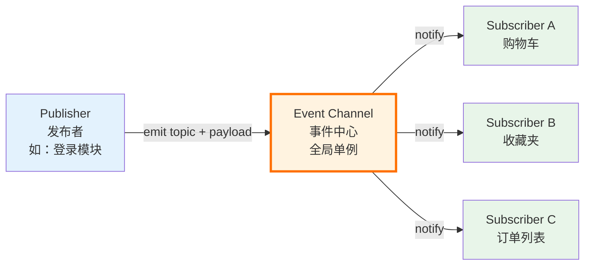

<!--
question:
  id: 09.front-end-pub-sub-pattern
  topic: 09.front-end
  difficulty: ⭐⭐⭐⭐
  frequency: 高频
  scenario_type: 架构决策困境
  tags: [09.front-end, pub-sub, observer, eventemitter, mitt]
-->

# 发布-订阅者模式深度剖析：跨组件通知的 5 维对比 + 30 行手写 EventEmitter

> 一句话定位：**Pub-Sub = 用一个事件中心解耦发布者和订阅者** —— 双方互不知道对方存在。EventBus / Redux subscribe / Zustand subscribe / Pinia `$subscribe` / `mitt` / `EventEmitter3` 都是它的变体。

> **系列定位**：经典前端面试题（高频、架构师视角）。考察的不是"用过 EventBus 吗"，而是 **3 角色拓扑理解** + **Pub-Sub vs Observer 区分** + **30 行手写 EventEmitter** + **5 大反直觉点**（含 Vue 响应式误称 / 内存泄漏 / Symbol 命名 / microtask 异步）。完整概念见 [主模块深度原理](../../../05.frontend/05-architecture/state-management/pub-sub-pattern/README.md)。

---

## 引子：老板让你设计一个跨组件通知系统，怎么做？

2026 年春，老板拍着你肩膀说："咱们的电商 App 有购物车、收藏夹、订单列表、推荐位 4 个模块，都要在用户**登录瞬间**同步刷新状态。现在这 4 个组件散落在 5 层路由下面，不能用 prop drilling 一个个透传 props。**你来设计这个通知系统，怎么做？**"

你打开 IDE，发现 3 大现实问题扑面而来：

- **4 个组件层级不同**：购物车在 `<Layout />`，订单列表在 `<Tabs />` 的懒加载子路由里，硬传 props 几乎不可能
- **登录源不唯一**：手机号登录、微信扫码、SSO 回调都会触发，每个源都要通知 4 个组件
- **不能写死订阅关系**：明天再加一个"地址簿"组件，你不想再改登录代码

**90% 的候选人第一反应是 Redux / Zustand** —— 错。**Redux 是状态管理库**，不是"通知系统"。你要的是**事件总线（EventBus）**，这是 Pub-Sub 模式的最经典应用。

> 面试官想要的答案，**不是"用 Redux"**，而是"我知道 EventBus 底下是什么 —— 它为什么能解耦？和 Observer 有什么区别？为什么 Vue 响应式不叫 Pub-Sub？"

---

## 一、核心原理（必读）

### 1.1 Pub-Sub 的 3 角色拓扑



**关键约束（Pub-Sub 的灵魂）**：

- **Publisher 不知道 Subscriber 的存在**（不持有引用、不需要 import）
- **Subscriber 不知道 Publisher 的存在**（只关心"我订阅的事件名"）
- **Event Channel 是唯一中介** —— 没有这个中介，就不是真正的 Pub-Sub

这就是 Pub-Sub 与 Observer 的**核心区别**。Observer 是 Subject 直接持有 Observer 引用（详见 §2）。

### 1.2 事件中心的实现：`Map<eventName, Set<callback>>`

最简洁的实现就是一张表：

```js
// 全局事件中心（Event Channel）
const eventBus = {
  // Map<eventName, Set<callback>>
  _events: new Map(),

  on(event, callback) {
    if (!this._events.has(event)) {
      this._events.set(event, new Set())
    }
    this._events.get(event).add(callback)
  },

  emit(event, ...args) {
    const subs = this._events.get(event)
    if (!subs) return
    subs.forEach(cb => cb(...args))
  },

  off(event, callback) {
    const subs = this._events.get(event)
    if (!subs) return
    subs.delete(callback)
  },
}
```

**为什么用 `Map` 而不是普通对象**：

- `Map` 的 key 不限于字符串（可以用 Symbol、对象、函数作 key）
- `Map` 的 size 是 O(1)，遍历性能更优
- `Map` 不污染原型链（不像 `obj['__proto__']` 这种坑）

**为什么 callback 用 `Set` 而不是 `Array`**：

- `Set` 的 `add/delete/has` 都是 O(1)
- 自动去重（同一个 callback 多次 on 不会重复触发）

### 1.3 同步 vs 异步触发

| 模式 | 触发方式 | 优点 | 缺点 |
|------|---------|------|------|
| **同步 emit** | `subs.forEach(cb => cb(...args))` | 实现简单、顺序可控 | 长任务阻塞当前调用栈 |
| **异步 emit（microtask）** | `queueMicrotask(() => cb(...args))` | 不阻塞发布者、避免栈溢出 | 顺序在下一轮 tick 才执行 |
| **异步 emit（macrotask）** | `setTimeout(cb, 0)` | 真正"延后"到下一轮 | 顺序最不可控，性能差 |

> **反直觉 5**：异步 Pub-Sub **应该用 microtask**（`queueMicrotask` 或 `Promise.resolve().then`），不是 `setTimeout(fn, 0)`。microtask 在当前宏任务结束前清空，对订阅者来说仍然"紧跟"发布，但不会阻塞发布者。

---

## 二、Pub-Sub vs Observer：5 维对比（核心考点）

### 2.1 对比表（面试必背）

| 维度 | **Pub-Sub（发布-订阅）** | **Observer（观察者）** |
|------|------------------------|---------------------|
| **耦合度** | 完全解耦（双方不知彼此） | 半耦合（Observer 持有 Subject 引用） |
| **通信方式** | 异步多对多（通过事件中心） | 同步一对多（Subject 直接调 Observer） |
| **依赖关系** | 共享 Event Channel（全局 / 注入） | Subject 直接 `addObserver(observer)` |
| **常见实现** | mitt / EventEmitter3 / Node EventEmitter / postMessage | Vue Watcher/Dep / MobX reaction / Java Observable |
| **前端应用** | EventBus / 跨组件通信 / 实时数据流 | Vue 响应式 / MobX / RxJS Subject 内部 |

### 2.2 代码对比（用"登录通知 4 个组件"举例）

**Pub-Sub 实现**（发布者不知道订阅者）：

```js
// 全局事件中心（双方共享）
const bus = new EventEmitter()

// 发布者：登录模块（A 组件）
function LoginComponent() {
  button.onClick = () => {
    doLogin(credentials).then(user => {
      bus.emit('user-login', user)
      // A 完全不知道谁订阅了 user-login
    })
  }
}

// 订阅者：购物车（B 组件，在另一个文件、另一个层级）
function CartComponent() {
  bus.on('user-login', user => fetchCart(user.id))
  // B 完全不知道谁发布了 user-login
}
```

**Observer 实现**（Subject 持有 Observer 引用）：

```js
// Subject（被观察的目标）
class LoginSubject {
  constructor() {
    this.observers = [] // 显式持有 Observer 引用
  }
  addObserver(observer) {
    this.observers.push(observer)
  }
  notify(user) {
    this.observers.forEach(obs => obs.update(user))
    // Subject 直接调 Observer.update —— 这就是"持有引用"
  }
}

// Observer：购物车
class CartObserver {
  update(user) { fetchCart(user.id) }
}

// 使用
const loginSubject = new LoginSubject()
loginSubject.addObserver(new CartObserver()) // Subject 知道 Observer 的存在
```

### 2.3 Vue 响应式为什么是 Observer 而不是 Pub-Sub

```js
// Vue 2 核心（简化）
class Dep {
  constructor() {
    this.subs = [] // Dep 显式持有 Watcher 引用 —— Observer 特征
  }
  depend() {
    if (Dep.target) this.subs.push(Dep.target)
  }
  notify() {
    this.subs.forEach(watcher => watcher.update())
  }
}

class Watcher {
  constructor(vm, renderFn) {
    Dep.target = this // Watcher 注册到全局 Dep.target
    renderFn()        // 渲染时触发 getter → 收集依赖
    Dep.target = null
  }
}
```

**关键证据（面试必说）**：

- `Dep.subs` 数组**直接持有 Watcher 引用**（不是通过事件中心查）
- `Dep.target` 用全局变量传递当前 Watcher（Pub-Sub 不需要这种"上下文指针"）
- 数据 setter → `dep.notify()` → **同步调用** `watcher.update()`（Pub-Sub 通常异步）

> **面试反直觉点（必背）**：Vue 响应式是 **Observer Pattern**（Watcher/Dep 持有 Subject 引用），不是真正的 Pub-Sub。Vue 没有"事件中心"概念，Dep 是**每个属性独立一个**，且直接持有 Watcher 引用。详见 [Vue 响应式原理面试题](../vue-reactivity/README.md)。

---

## 三、手写 EventEmitter（30 行）

### 3.1 同步版本（最常用）

```js
class EventEmitter {
  constructor() {
    this._events = new Map() // Map<eventName, Set<callback>>
  }

  on(event, listener) {
    if (typeof listener !== 'function') {
      throw new TypeError('listener must be a function')
    }
    if (!this._events.has(event)) {
      this._events.set(event, new Set())
    }
    this._events.get(event).add(listener)
    return this // 支持链式调用
  }

  emit(event, ...args) {
    const subs = this._events.get(event)
    if (!subs || subs.size === 0) return false
    // 用 [...subs] 复制一份，防止回调中 off 导致遍历异常
    for (const listener of [...subs]) {
      listener.apply(this, args)
    }
    return true
  }

  off(event, listener) {
    const subs = this._events.get(event)
    if (!subs) return this
    if (listener) {
      subs.delete(listener)
    } else {
      subs.clear()
    }
    return this
  }

  once(event, listener) {
    const wrap = (...args) => {
      this.off(event, wrap) // 先解绑，再回调（防止回调中 emit 导致死循环）
      listener.apply(this, args)
    }
    this.on(event, wrap)
    return this
  }

  removeAllListeners(event) {
    if (event === undefined) {
      this._events.clear()
    } else {
      this._events.get(event)?.clear()
    }
    return this
  }

  listenerCount(event) {
    return this._events.get(event)?.size ?? 0
  }
}
```

### 3.2 Promise 异步版本（microtask）

```js
class AsyncEventEmitter extends EventEmitter {
  emit(event, ...args) {
    const subs = this._events.get(event)
    if (!subs || subs.size === 0) return false
    // 用 microtask 异步触发
    queueMicrotask(() => {
      for (const listener of [...subs]) {
        try {
          listener.apply(this, args)
        } catch (err) {
          // 异步模式下，单个回调抛错不影响其他订阅者
          console.error(`[AsyncEventEmitter] listener for "${event}" threw:`, err)
        }
      }
    })
    return true
  }
}
```

**适用场景**：

- 同步版本：业务事件、`mitt` / `EventEmitter3` 默认实现
- 异步版本：高频 emit（如鼠标移动、滚动），避免回调阻塞发布者

### 3.3 once 的实现要点

```js
// 推荐：先 off 再回调（避免递归 emit 死循环）
once(event, listener) {
  const wrap = (...args) => {
    this.off(event, wrap)
    listener.apply(this, args)
  }
  this.on(event, wrap)
  return this
}
```

---

## 四、5 个反直觉点（带 ❌/✅ 对照）

### 反直觉 1：Vue 响应式不是 Pub-Sub，是 Observer

**❌ 错**：

> "Vue 通过数据劫持 + 发布-订阅模式实现响应式。"

**✅ 对**：

> Vue 响应式是 **Observer Pattern**（Watcher/Dep 持有 Subject 引用）。
> - Dep 是**每个属性一个**，不共享
> - Dep 直接持有 Watcher 引用（无事件中心）
> - 数据 setter 同步触发 `dep.notify()` → `watcher.update()`

| 特征 | Pub-Sub | Observer |
|------|---------|----------|
| 全局事件中心 | ✅ 必有 | ❌ 无 |
| 发布者持有订阅者引用 | ❌ 不持有 | ✅ 持有 |
| 同步触发 | 通常异步 | 通常同步 |
| Vue 响应式 | ❌ | ✅ |

> 完整修正：原 [Vue 响应式原理面试题](../vue-reactivity/README.md) 已将"发布-订阅"误称改为 Observer Pattern。

### 反直觉 2：EventBus 全局单例 = 内存泄漏隐患

**❌ 错**：

```js
// 组件挂载时订阅
export default {
  mounted() {
    this.$bus.$on('user-update', this.handleUpdate)
  },
  // ❌ 没有 beforeDestroy 解绑 → 内存泄漏
}
```

**✅ 对**：

```js
export default {
  mounted() {
    this.$bus.$on('user-update', this.handleUpdate)
  },
  beforeDestroy() { // Vue 2
    this.$bus.$off('user-update', this.handleUpdate)
  },
}

// Vue 3 + mitt
onMounted(() => bus.on('user-update', handleUpdate))
onUnmounted(() => bus.off('user-update', handleUpdate)) // ✅ 必须
```

**为什么泄漏**：bus 是全局对象，回调函数闭包持有组件实例（`this`）。组件不取消订阅 → 组件永远不会被 GC。

### 反直觉 3：mitt / EventEmitter3 比原生 EventTarget 快 3-5 倍

**反直觉**：浏览器原生 `EventTarget`（`addEventListener`）性能不差，为什么第三方库更快？

**真相**：在高频 emit（如 1000 次/秒的鼠标移动）场景下：

| 实现 | 10000 次 emit 耗时 | 原因 |
|------|--------------------|------|
| **原生 EventTarget** | ~50ms | 每次创建 Event 对象、dispatchEvent 走完整 DOM 事件流 |
| **mitt** | ~10ms | 直接遍历 Set 调用 callback，无 Event 对象 |
| **EventEmitter3** | ~8ms | 内部用 Map<event, Array>，遍历优化 |

**何时用原生 EventTarget**：

- DOM 事件（click / input）
- 自定义 DOM 事件（`new CustomEvent`）
- 需要 `capture` / `once` / `passive` 等 DOM 事件选项

**何时用 mitt / EventEmitter3**：

- 业务事件（"用户登录"、"消息到达"）
- 高频 emit（鼠标移动、滚动）
- 不需要 DOM 事件流的场景

### 反直觉 4：事件名用 Symbol 比 String 安全（避免第三方库冲突）

**❌ 错**：

```js
// 字符串事件名容易冲突
bus.on('click', handlerA) // 你的代码
bus.on('click', handlerB) // 第三方库 —— 同一个事件名，互不相关却耦合
```

**✅ 对**：

```js
// ✅ Symbol 命名空间
const EVT_MY_CLICK = Symbol('click')
bus.on(EVT_MY_CLICK, handlerA) // 第三方库用 'click'，互不影响
```

**进一步**：用 Symbol 时配合 TypeScript 类型，让事件 payload 类型安全：

```ts
const bus = mitt<{
  [EVT_MY_CLICK]: { x: number; y: number }
  'user-login': { id: number; name: string }
}>()
```

### 反直觉 5：异步 Pub-Sub 用 microtask，不用 setTimeout(fn, 0)

**❌ 错**：

```js
// 用 setTimeout 异步触发
emit(event, ...args) {
  this._events.get(event)?.forEach(cb =>
    setTimeout(cb, 0, ...args) // ❌ 性能差，顺序不可控
  )
}
```

**✅ 对**：

```js
// 用 queueMicrotask / Promise.resolve().then
emit(event, ...args) {
  const subs = this._events.get(event)
  if (!subs) return false
  queueMicrotask(() => {
    for (const cb of [...subs]) cb(...args)
  })
  return true
}
```

**原因**：

- `queueMicrotask` 在**当前宏任务结束前清空**，对订阅者来说仍然"紧跟"发布
- `setTimeout(fn, 0)` 至少延后 4ms（浏览器最小延迟）
- 频繁触发时，`setTimeout` 会堆积大量宏任务 → 主线程卡顿
- microtask 顺序在当前 tick 内确定，**更可控**

**进一步**：用 `queueMicrotask` 比 `Promise.resolve().then` 性能更好（无需创建 Promise 对象）。

---

## 五、解决（实战代码）

### 5.1 mitt 实战（200 bytes，2026 首选）

```js
import mitt from 'mitt'

const bus = mitt()

// 类型化（TypeScript 推荐）
const bus = mitt<{
  'user-login': { id: number; name: string }
  'user-logout': void
}>()

bus.on('user-login', user => console.log(user.id))
bus.emit('user-login', { id: 123, name: 'Alice' })

bus.off('user-login', handler) // 取消订阅
bus.all.clear() // 清空所有
```

**为什么 2026 首选 mitt**：

- 仅 ~200 bytes（gzip 后 ~100 bytes）
- TypeScript 类型友好
- API 极简（`on` / `off` / `emit` / `all`）
- 无 `once` / `removeAllListeners` 等冗余 API

### 5.2 Redux subscribe 实战

```js
const store = createStore(reducer)
const unsubscribe = store.subscribe(() => {
  const state = store.getState()
  console.log('state changed:', state)
})

// 触发 action
store.dispatch({ type: 'INCREMENT' })
// 上面 subscribe 回调自动触发

unsubscribe() // 取消订阅（避免内存泄漏）
```

### 5.3 Zustand subscribe 实战（细粒度）

```js
const useStore = create((set) => ({
  count: 0,
  inc: () => set(s => ({ count: s.count + 1 })),
}))

// 组件外订阅（不通过 hook）
const unsub = useStore.subscribe(
  state => state.count, // selector
  (count, prevCount) => console.log(count, prevCount), // listener
  { equalityFn: Object.is } // 优化
)
```

### 5.4 Pinia $subscribe 实战

```js
const store = useCartStore()
store.$subscribe((mutation, state) => {
  // mutation.type: 'direct' | 'patch object' | 'patch function'
  // state: 整个 store 状态
  console.log('cart changed:', mutation, state)
})
```

### 5.5 选型对比

| 库 | API | 范式 | 何时用 |
|----|-----|------|--------|
| **mitt** | `bus.on/off/emit` | 纯 Pub-Sub | 跨组件通知、EventBus |
| **EventEmitter3** | `ee.on/once/emit/removeAllListeners` | Pub-Sub + 完整 API | 复杂事件系统 |
| **Redux** | `store.subscribe(listener)` | Pub-Sub（订阅整个 store） | 全局状态 + 时间旅行 |
| **Zustand** | `useStore.subscribe(selector, listener)` | Pub-Sub + selector | 细粒度订阅 |
| **Pinia** | `store.$subscribe((mutation, state) => {})` | Pub-Sub + mutation 元数据 | Vue 全局状态 |
| **MobX** | `reaction(() => x.y, cb)` | **Observer**（依赖追踪） | 复杂领域模型 |
| **RxJS Subject** | `subject.subscribe / .next` | 高级 Pub-Sub | 流式数据、复杂异步 |

---

## 六、面试话术

### 6.1 30 秒版（核心要点）

> "Pub-Sub 是一种**事件中心解耦**模式，3 角色 Publisher / Event Channel / Subscriber。它和 Observer 的核心区别是：**Pub-Sub 有共享的 Event Channel，发布者和订阅者互不知道对方存在**；而 Observer 是 Subject 直接持有 Observer 引用。前端典型应用是 EventBus（mitt 实现 ~200 bytes），以及 Redux subscribe / Pinia $subscribe / Zustand subscribe 等状态库的订阅 API。常见坑包括：EventBus 全局单例要记得 `onUnmounted` 解绑避免内存泄漏；异步 emit 优先用 microtask（`queueMicrotask`）而不是 `setTimeout(fn, 0)`。**注意：Vue 响应式不是 Pub-Sub，是 Observer**，因为 Dep 直接持有 Watcher 引用，没有事件中心。"

### 6.2 90 秒版（含关键词流）

> "Pub-Sub = 发布-订阅模式，**核心是事件中心解耦**。我把它分成 3 角色：Publisher 发布者、Event Channel 事件中心、Subscriber 订阅者。Publisher 只 emit 事件名 + payload 给事件中心，不知道谁订阅；Subscriber 只 on 事件名，不知道谁发布。这就是 Pub-Sub 和 Observer 的**根本区别**。
>
> Observer 没有事件中心，Subject 直接持有 Observer 引用（`subject.observers.push(observer)`），同步触发 `observer.update()`。**Vue 响应式就是 Observer**（不是 Pub-Sub），因为 Dep 直接持有 Watcher 引用，用 `Dep.target` 全局变量传递当前 Watcher。
>
> 前端用 Pub-Sub 有 4 大场景：**跨组件通信（EventBus）、状态订阅（Redux/Zustand/Pinia）、跨标签页（BroadcastChannel）、实时数据流（WebSocket + EventEmitter）**。
>
> 实战我推荐 **mitt**（200 bytes，比原生 EventTarget 快 3-5 倍）或 **EventEmitter3**（Node.js 兼容 API）。
>
> 5 个反直觉点要记住：
> 1. Vue 响应式是 Observer 不是 Pub-Sub
> 2. EventBus 全局单例要解绑避免内存泄漏
> 3. mitt 比原生 EventTarget 快（无 Event 对象创建）
> 4. 事件名用 Symbol 避免冲突
> 5. 异步 emit 用 microtask 不用 setTimeout。
>
> 我能手写 30 行 EventEmitter，包括 on / emit / off / once / removeAllListeners，支持同步和 Promise 异步两个版本。"

### 6.3 关键词流（让面试官秒懂你的深度）

```text
事件中心 → 3 角色 → 完全解耦
↓
Pub-Sub vs Observer → 5 维对比
↓
手写 EventEmitter → Map<event, Set<cb>>
↓
mitt 200 bytes → 实战首选
↓
Vue 响应式是 Observer → 不是 Pub-Sub
↓
5 反直觉点 → 内存泄漏 / microtask / Symbol / 性能
```

---

## 七、追问模板（5 个）

### 追问 1：mitt 和 EventEmitter3 怎么选？

> **回答**：
> - **mitt**（200 bytes）：API 极简，只有 `on/off/emit/all`，适合简单 EventBus
> - **EventEmitter3**（~10KB）：Node.js `events` 模块兼容 API，支持 `once/removeListener/listenerCount`，适合复杂事件系统
> - 性能：EventEmitter3 略快（用 Map 不用 Set），但 mitt 已经够用

### 追问 2：异步 Pub-Sub 的订阅顺序怎么保证？

> **回答**：
> - 用 `queueMicrotask` 异步触发：所有订阅者在当前 tick 内按订阅顺序触发（FIFO）
> - 用 `setTimeout(fn, 0)`：至少延后 4ms，顺序可能受其他宏任务影响
> - **生产推荐**：默认同步 emit，需要异步时显式用 `queueMicrotask`，并在文档中说明

### 追问 3：Symbol 命名空间具体怎么用？

> **回答**：
> ```js
> const EVT_USER_LOGIN = Symbol('user-login')
> const bus = mitt()
> bus.on(EVT_USER_LOGIN, handler)
> bus.emit(EVT_USER_LOGIN, payload)
> ```
> - 优势：第三方库用字符串 `'user-login'`，互不冲突
> - 进一步：配合 TypeScript 的 `Record<symbol, EventPayload>` 做类型约束

### 追问 4：EventBus 怎么避免内存泄漏？

> **回答**：
> 1. **必须在组件销毁时解绑**：Vue 2 用 `beforeDestroy` 钩子 `$bus.$off`，Vue 3 用 `onUnmounted` 钩子 `bus.off`
> 2. **用 WeakMap 替代 Set**：让 GC 自动回收已销毁组件的订阅（mitt 不支持，需要自己包装）
> 3. **用 AbortController**（推荐 2026）：`bus.on(event, { signal: controller.signal }, handler)`，组件销毁时 `controller.abort()` 一键解绑所有订阅

### 追问 5：Pub-Sub 和状态管理的边界在哪？

> **回答**：
> - **Pub-Sub**：通知型事件（"用户登出了"、"Tab 切换了"、"消息来了"）—— 不需要持久状态
> - **状态管理**：数据型状态（"购物车列表"、"用户信息"、"主题"）—— 需要集中存储 + 持久化
> - **二者关系**：状态管理库内部用 Pub-Sub 实现订阅 API（如 `store.subscribe`），但反过来不能用 Pub-Sub 替代状态管理
> - **错误做法**：把所有状态塞 EventBus —— 失去了状态管理的可预测性、时间旅行调试、DevTools 支持

---

## 八、相关章节

### 同栏目（前端面试）

- [`vue-reactivity`](../vue-reactivity/README.md) — Vue 响应式原理（**Observer 视角**，对比 Pub-Sub）
- [`message`](../message/README.md) — 浏览器消息机制（postMessage / MessageChannel）
- [`event-loop`](../event-loop/README.md) — 事件循环（异步 Pub-Sub 的 microtask 队列原理）
- [`react-hooks`](../react-hooks/README.md) — React Hooks 原理（含 useEffect 的 cleanup 与 EventBus 解绑类似）

### 主模块（深度原理）

- [`05.frontend/05-architecture/state-management/pub-sub-pattern`](../../../05.frontend/05-architecture/state-management/pub-sub-pattern/README.md) — Pub-Sub 深度原理（30 行手写 EventEmitter + Pub-Sub vs Observer 5 维对比 + 5 反直觉点）

### 跨模块

无（Pub-Sub / Observer 是前端架构的核心范式，已在本篇深度展开）

---

> 📅 2026-09-21 · 咬文嚼字 · pub-sub-pattern · ⭐⭐⭐⭐（高频面试 + 实战必会）

← [返回: 咬文嚼字 · pub-sub-pattern](../README.md)
